# データを分析する

[前のステップ](./01_preparedata.md) で、学習に使用するデータを用意しました。

このステップから、いよいよ Azure Machine Learning Studio を使用します。


まず、このステップではデータの **分析** を行います。  
これから学習しようとしているデータセットが、学習に適しているかどうかを調べるという作業です。

CSV データ（表形式の構造を持つデータ）の各列の相関関係を調べて、うまく予測ができるかの "当たり" を付ける作業です。

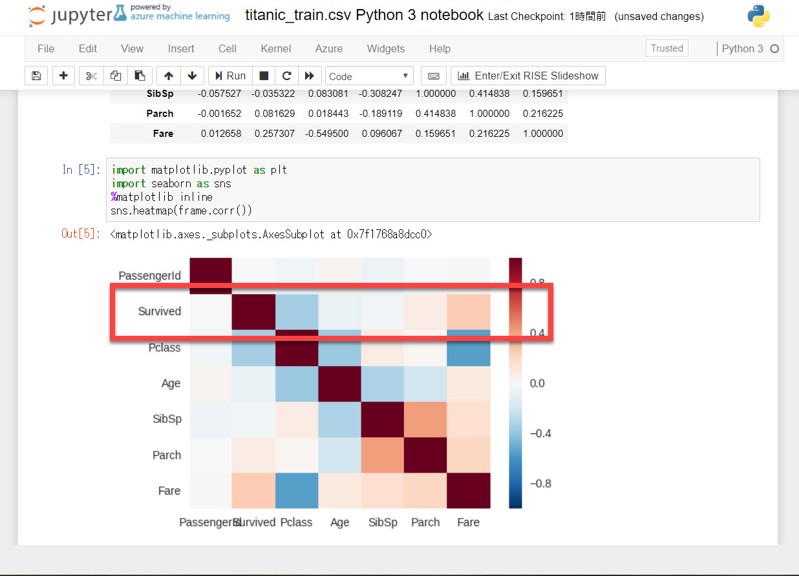

> あとで改めて確認しますが、今回使用するタイタニックの乗船リストは、予測したい値（目的変数と言ったりします）と与えるパラメーター（説明変数と言ったりします）との間には相関関係がありそうです。うまく学習できそうなデータです。

---

## Azure Machine Learning Studio にサインインする

早速データセットを Experiment に取り込み、分析をしていきます。  
Azure Machine Learning Studio にサインインするところからスタートします。

1. [**Azure Machine Learning Studio**](https://studio.azureml.net/) にアクセスして [**Sign In**] します。（2か所のどちらからでもよい）  

2. **Experiments** 画面に遷移すれば OK です。  
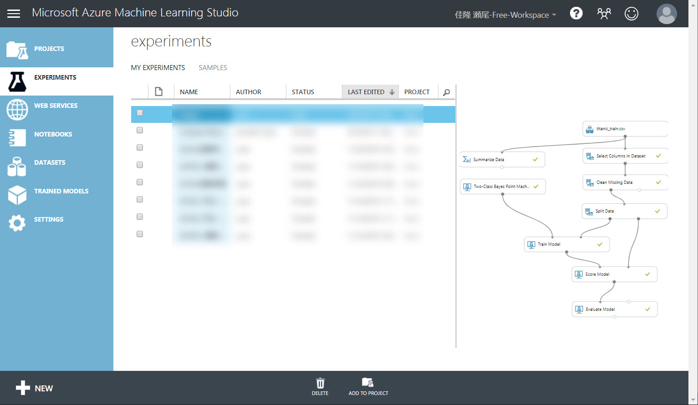

> このコンテンツでは、Azure Machine Learning Studio の FREE レベルを使用しています。  
> 複雑なモデルを作成したい場合や高速に学習を行いたい場合は、STARDARD レベルを使用することもできます。STANDARD レベルを使用するには Azure サブスクリプションが必要です。STANDARD レベルで有償の Workspace を作成する手順は [STANDARD レベルの Workspace 作成手順](./a01_createworkspace.md) を参照してください。

---

## データセットをアップロード

Kaggle から取得した [**タイタニック号の乗船リスト**](https://www.kaggle.com/c/titanic/data) を、自分の Azure Machine Learning Studio にアップロードします。

1. Kaggle からローカル PC に "train.csv" をダウンロードしたことを確認します。まだ入手していない場合は、[前のステップ](./01_preparedata.md) を参照して、データセットを取得してください。
2. (必須ではありませんが) "train.csv" のファイル名を "**titanic_train.csv**" に変更します。これはアップロード後に、何のデータセットかを分かりやすくするためです。
3. ページ下部にある [**NEW**] をクリックして、続いて [**DATASET**]-[**FROM LOCAL FILE**] をクリックします。  
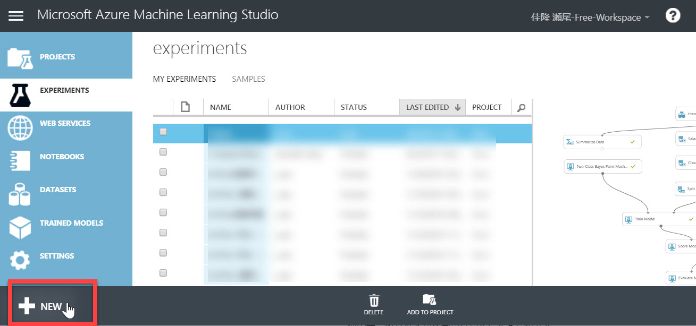  
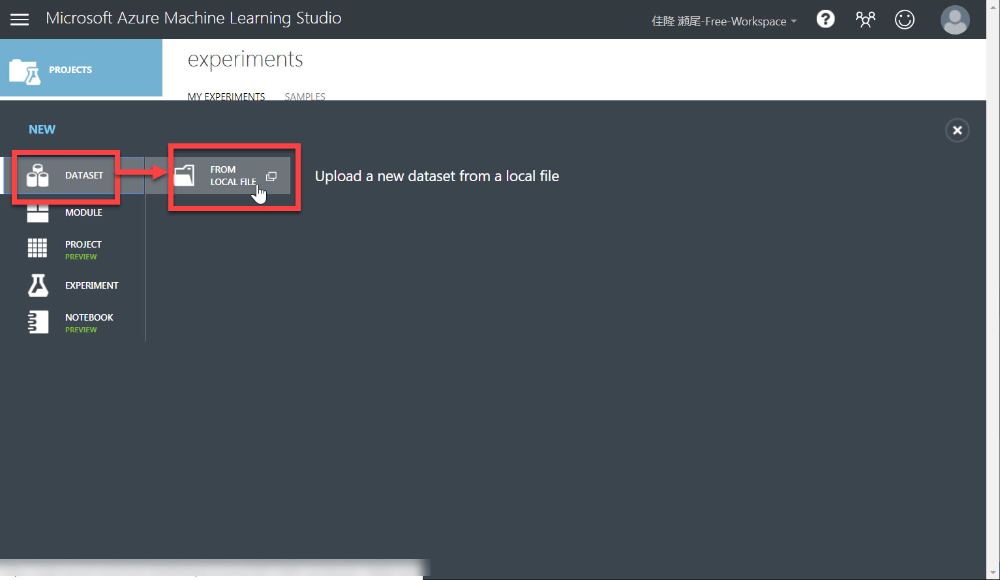
4. [**ファイルを選択**] をクリックして、"titanic_train.csv" を選択します。  
"EXISTING DATASET" および "SELECT A TYPE FOR THE NEW DATASET" はデフォルトのままでかまいません。
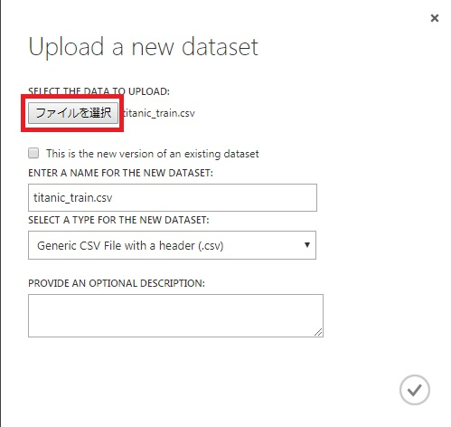  
   - EXISTING DATASET: ファイル名と同じ
   - SELECT A TYPE FOR THE NEW DATASET: "Generic CSV File with a header (.csv)"  
  ※今回の titanic_train.csv は 1行目がヘッダーなので "with a header" を選択します。他のデータセットでは、形式に応じて適切なものを選択します。  
5. 右下のチェック (Ok) をクリックして、データセットをアップロードします。
6. メニューで [DATASETS] をクリックして、"titanic_train.csv" がアップロードされていることを確認します。
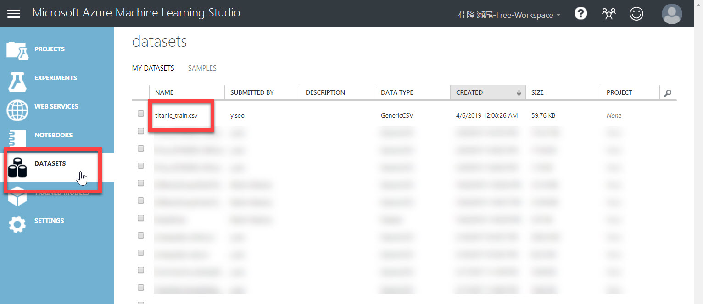

---

## Experiment の新規作成

Azure Machine Learning Studio では、データの分析、モデルの作成、学習など、機械学習の一連のフローはすべて **Experiment** 上で行います。

この後のステップのために Experiment を作成します。

1. ページ左下の [NEW] をクリックします。  
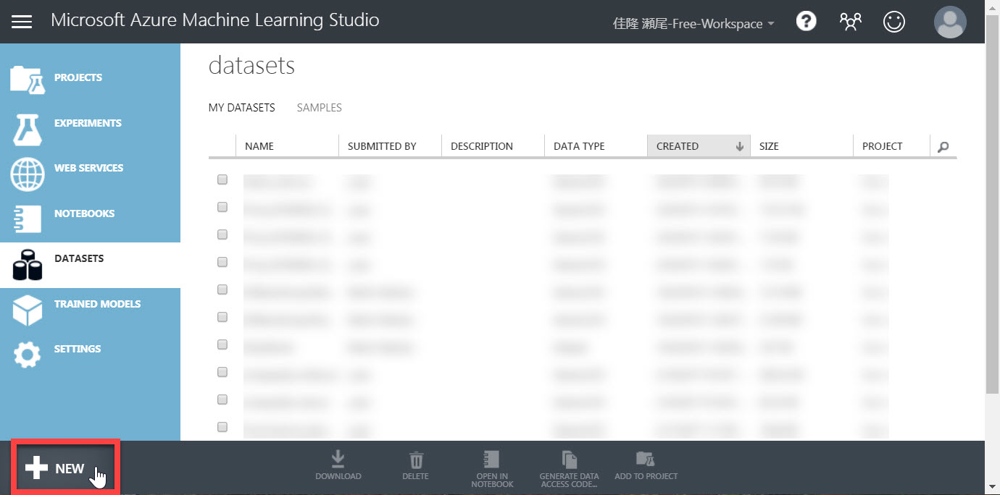  
2. **EXPERIMENT** をクリックして、続いて **Blank Experiment** をクリックします。  
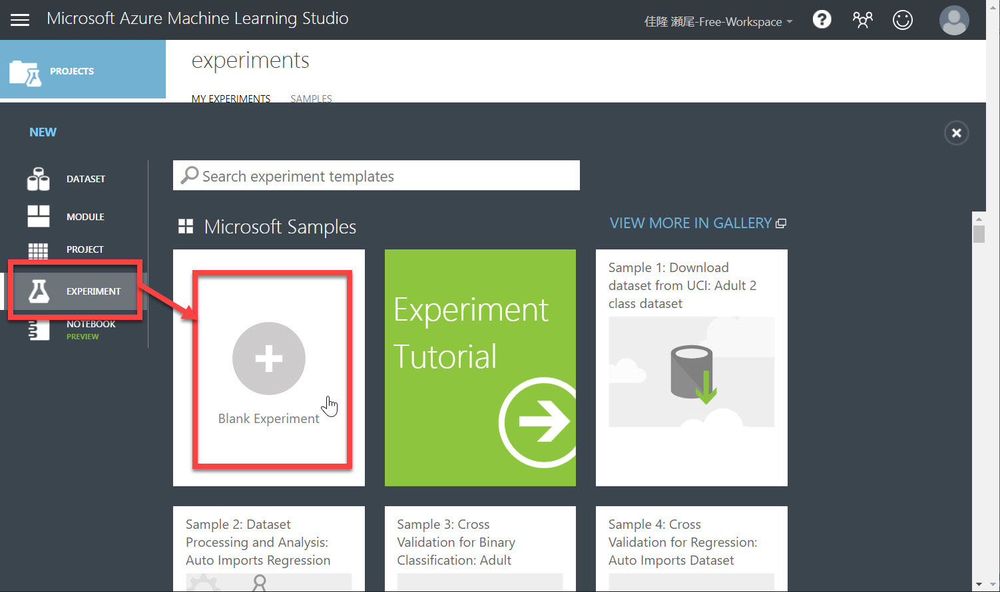  
3. 空白の Experiment が新規に作成されると以下の画面が表示されます。  
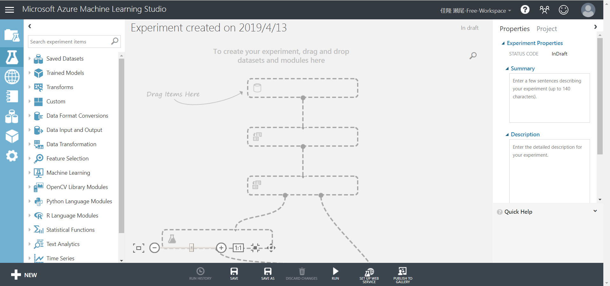  
4. (必須ではありませんが) Experiment のタイトルを変更します。Experiment の左上のタイトル部分をクリックして適切なものに変更します。（ここでは "Titanic" としておきます）  
タイトルは次に Experiment が保存されるタイミングで合わせて保存されます。  
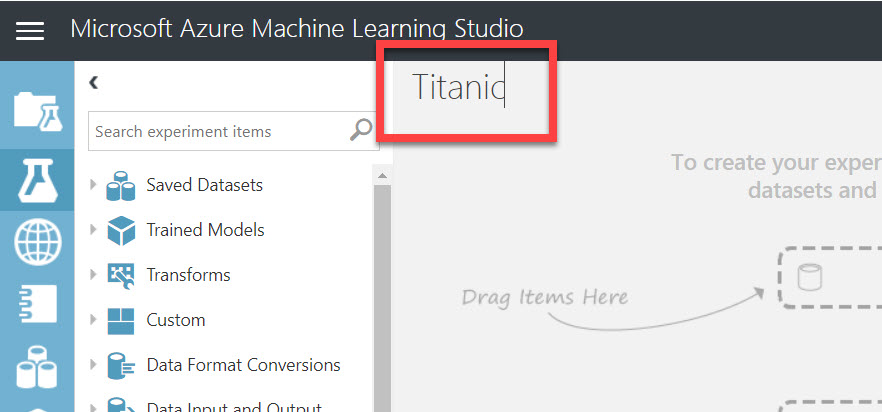

---

## データセットを Experiment に配置

Experiment ができたので、ここにデータセットを配置します。

1. [Saved Datasets]-[My Datasets] を開いて、"**titanic_train.csv**" を探します。これを **Experiment 画面にドロップ** します。  
なお、新規の Experiment にはモジュール配置のガイドラインが表示されていますが、その位置に置く必要はありません。  
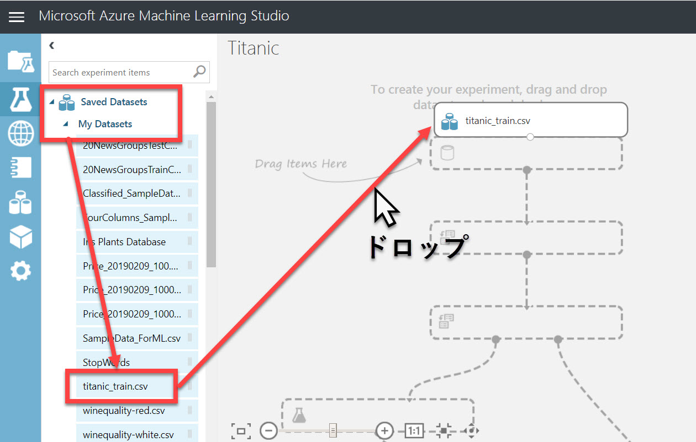

---

## データを分析

次に、データセットが学習に適したものかを **分析** します。  
どんなデータセットでも機械学習に使えるわけではないため、学習を始める前にデータの質を見てみます。

1. Experiment に配置した "**titanic_train.csv**" モジュールの下側の出力ノードを **右クリック** します。メニューが表示されたら **Visualize** を選択します。  
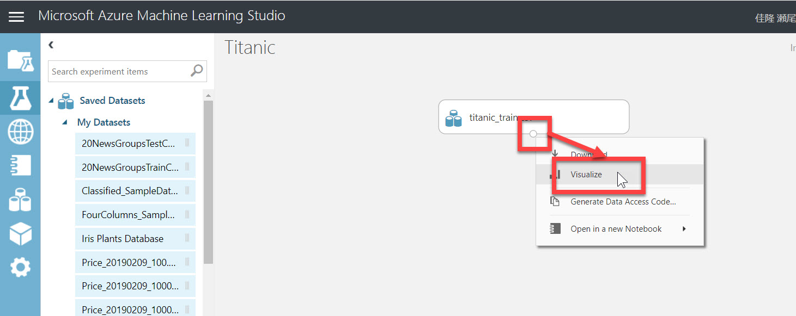
2. データセットのサイズとデータの一部とが表示されます。  
12 列のデータ 891行からなるデータだと分かります。
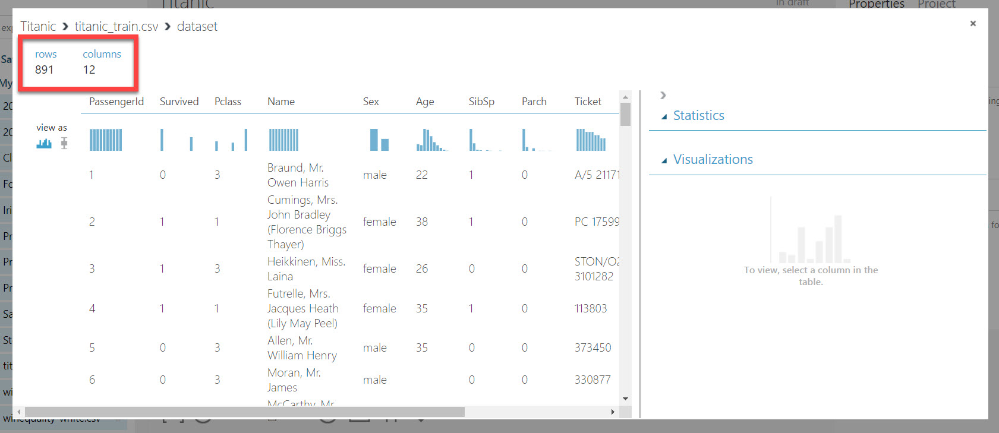  
3. 各列に欠損値がどのくらいあるか調べてみます。各列のヘッダーを順にクリックし、"**Statistics**" の "**Missing Values**" を見ます。これが欠損値の個数です。  
今回のデータセットでは、Age, Cagin, Embarked 列に欠損があることが分かります。  
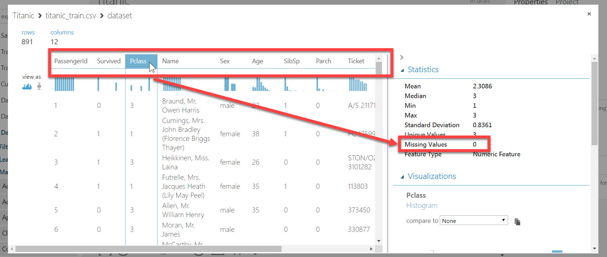  
   > 欠損値がある場合は、その列は使わない、その行を削除する、平均値を入れる、固定値 (0 など) を入れるなど、補う方法があります。どの方法を取るかは、モデルの目的や列の意味合いによって異なります。またはいくつかの補完をしたデータでモデルを学習して、それぞれを比較することもできます。  
今回のデータセットは、平均値を使う列 (Age) と欠損値を含む列を除く列 (Cabin, Embarked) とを使い分けます。  
欠損値以外の値（標準偏差など）も参照するほうがよいのですが、今回はこの後の手順で必要になる欠損値のみを確認しています。
4. 続いて、"Survived" 列（= 助かったかどうか、今回予測したい列）と他の列との **相関関係** を見てみます。  
**Survived** 列のヘッダーを選択します。その状態で、Ctrl キーを押しながら別の列ヘッダーをクリックします。  
分布が散らばっていれば。
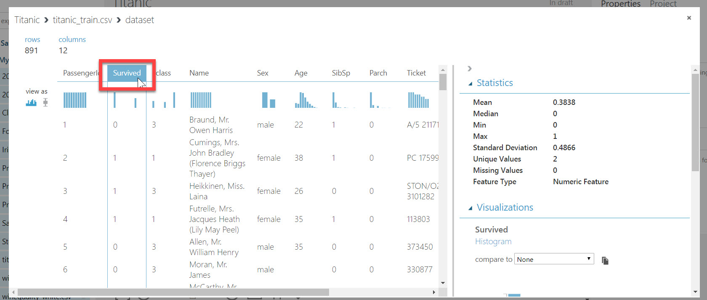  
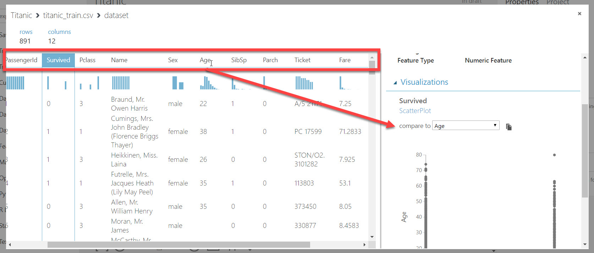  
   > Survived の値は 0 か 1 かのどちらかであり、例えば 0.5 ということはないため、散らばりが分かりづらいかもしれません。  
例えば、Survived と Age との関係では、年齢が高くなると Survived が 1 であるデータが少ないことが分かります。ただし、「データセットで、これに該当するデータがたまたま含まれていなかったから」という可能性もあります。
相関関係が比較的わかりやすいものとしては、Fare と Parch との関係があります。
5. PassengerId, Name, Ticket, Embarked は相関が認められない（または非常に相関が低い）ことを確認します。これらは学習モデルを作る際に、除外して考えてよさそうです。

---

## 相関関係をもっと分かりやすくする

上の手順で列同士の相関関係の概要が分かったと思いますが、確認の操作が面倒で、直感的に分かりづらいかもしれません。

もっと全体を俯瞰した形で見てみます。  
ここでは **Jupyter Notebook** を使ってデータセットを見てみます。

1. "titanic_train.csv" の下側のノードを **右クリック** します。メニューが表示されたら **Open in a new Notebook** を選択し、さらに **Python 3** を選択します。
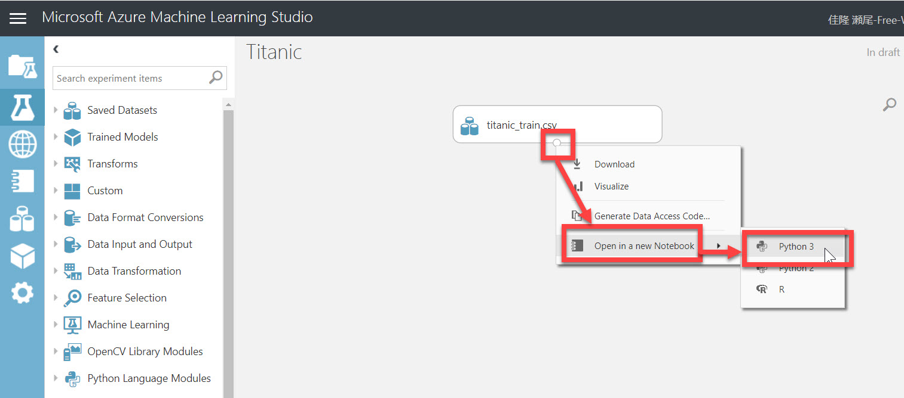  
2. Jupyter Notebook が開き、2個のセルがあることを確認します。
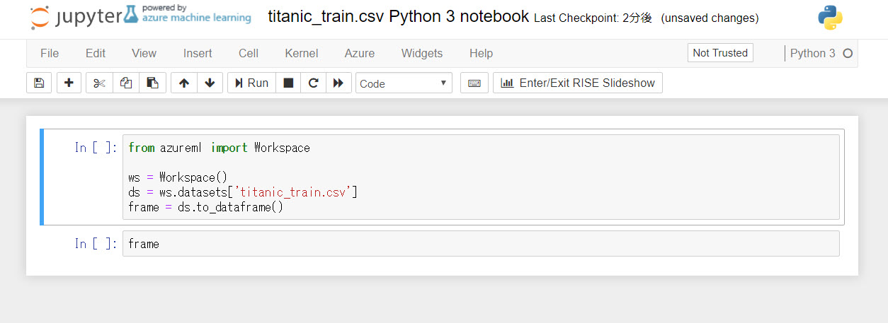  
3. Shift + Enter または ツールバーの [Run] で１個ずつ実行します。  
書式は違いますが、データセットの一部が表示されます。
   > **In [ ]** の表示が **In [数字]** に変わるのを待ってから次のセルを実行するようにします。

   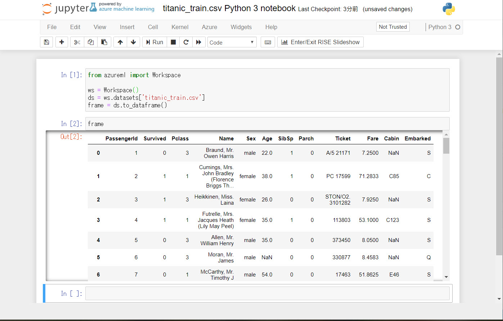
4. 一番下の空のセルに以下を入力して、Shift + Enter で実行します。  
各列の相関関係が表形式で表示されます。1 に近いほど正の相関関係、-1 に近いほど負の相関関係があります。

   ```python
   frame.corr()
   ```

   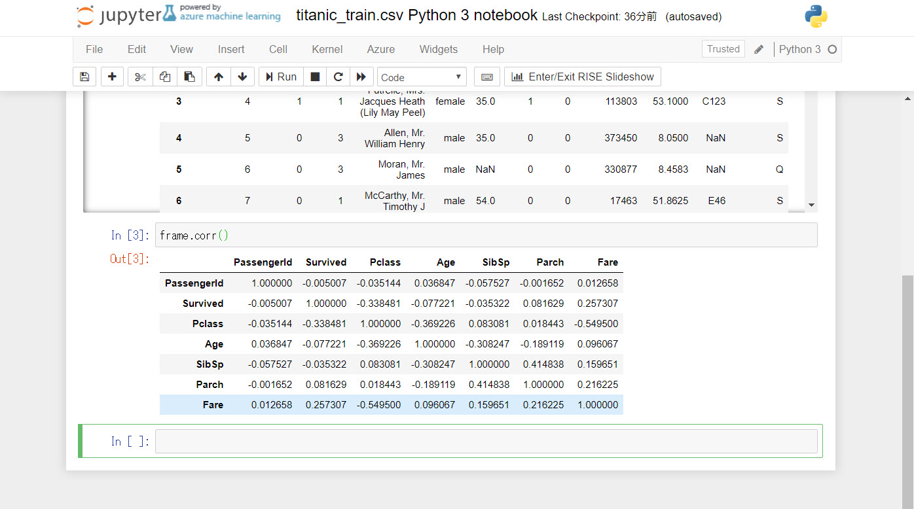  

---

## 相関関係をヒートマップで確認

表形式で各列の相関関係を確認できましたが、ヒートマップを使うともっと直感的に関係が分かります。

1. Notebook の一番下の空のセルに以下を入力して、Shift + Enter で実行します。  
色が濃いほど強い相関関係を持つことを表します。Survived に対しては Pclass, Fare が強い相関を持つことが分かります。

   ```python
   import matplotlib.pyplot as plt
   import seaborn as sns
   %matplotlib inline
   sns.heatmap(frame.corr())
   ```

   
   > 初回の実行時には警告が表示されるかもしれません。ヒートマップが表示されれば問題ありません。

---

## (オプション) 別の方法 (Summarize Data モジュール) で欠損の確認

データ欠損の個数の確認やデータセットの統計情報を確認するには、別の方法もあります。  
**Summarize Data** モジュールを使います。

> この手順は必須ではありません。

1. モジュール一覧で [Statistical Functions]-[Summarize Data] を探し、Experiment にドロップします。  
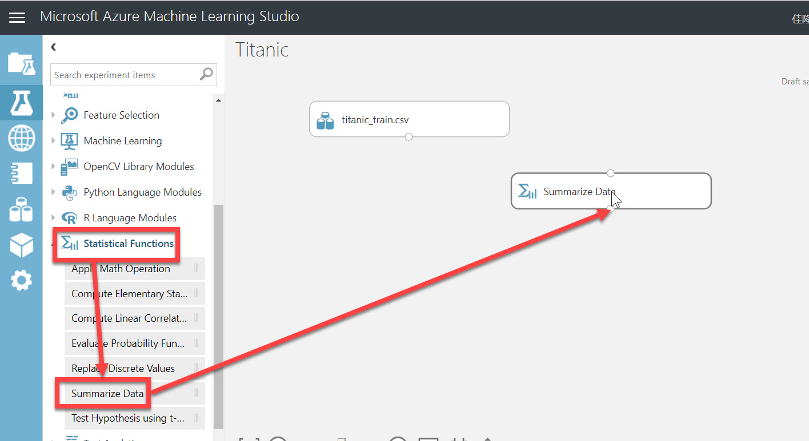  
2. "tatanic_train.csv" の下側の出力ノードから "Summarize Data" の上側の入力ノードにドラッグして、2つの **モジュールを接続** します。  
  
3. [Run]-[Run Selected] で、Summarize Data モジュールを実行します。  
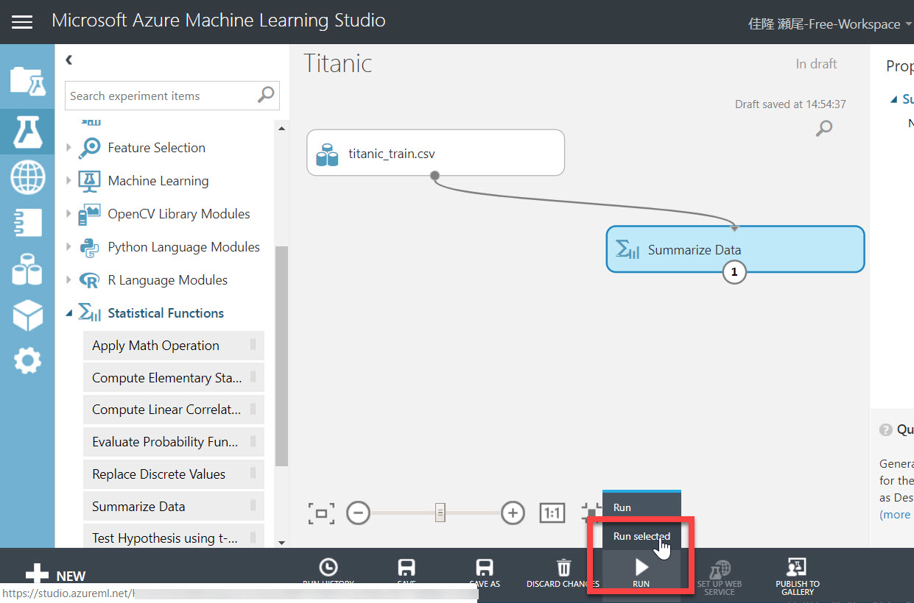  
4. [Summarize Data] の下側の出力ノードを右クリックして、[Visualize] を選択します。  
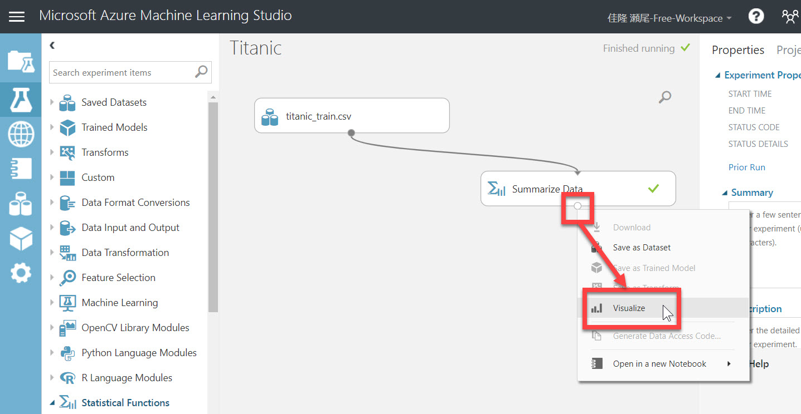  
5. "Resuts dataset" が開いたら、[Missing Value Count] で、データ欠損の個数を確認します。  
ここでも、"Age" 列および "Cabin" 列に欠損があることを確認します。
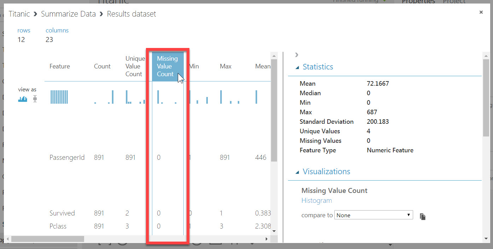

---

以上で、データの分析ができました。

次のステップでは、モデルを作るのに適した形式に [データを整形](./03_dataformat.md) します。