# データを整形する

[データを分析](./02_preparedata.md) した結果、以下の特徴が分かりました。

- Survived を予測する上では、PassengerId, Name, Ticket, Embarked は必要なさそうです。  
  これらは直感的にも理解しやすいと思います。例えば、氏名によって助かりやすい・助かりづらいということはなさそうです。（仮に名前の順で部屋が割り当てられていれば、Name と Survived との間に相関があったかもしれません。ただしデータを分析した限りでは、それはなさそうです）
- Age の欠損が目立ちます。891 件中の 177 件のデータで Age が空です。  
  Age が空のデータを削除するやり方もありますが、今回は Age が空のものには年齢の平均値を入れることにします。Age と Survived との間には相関関係はありますが弱い相関なので、平均値を入れても大きな問題にはならないでしょう。  
  全件数が多いわけではなく、またAge が欠損している割合が多いため、"貴重な" データを捨てたくないことも理由です。
- Cabin ではデータの欠損がさらに多く、687 件で欠損しています。  
  文字列であることから、平均値を出すこともできず、また何か代表値を入れるのも適切だとは思えません。このことから、今回は Cabin を学習しないことにします。

> これらの特徴が「予測に大きく影響することはない」とは言い切れません。  
> 現実の機械学習では、可能な範囲でいくつか異なる学習モデルを作ってみた上で、最適なものを選択するのがよいでしょう。（例えば、Age が欠損した行は削除する、Cabin も学習するなど、条件を変えてみて）  

ここからは、上記を元に **データを整形** します。  

- データセットを学習に使用する列だけにする
- 欠損しているデータを補完する

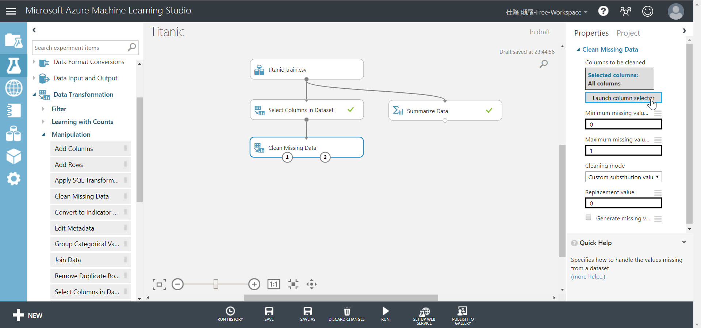

---

## 学習に使用する列だけにする

1. モジュール一覧で、[Data Transformation]-[Manipulation]-[**Select Columns in Dataset**] を探し、Experiment にドロップします。  
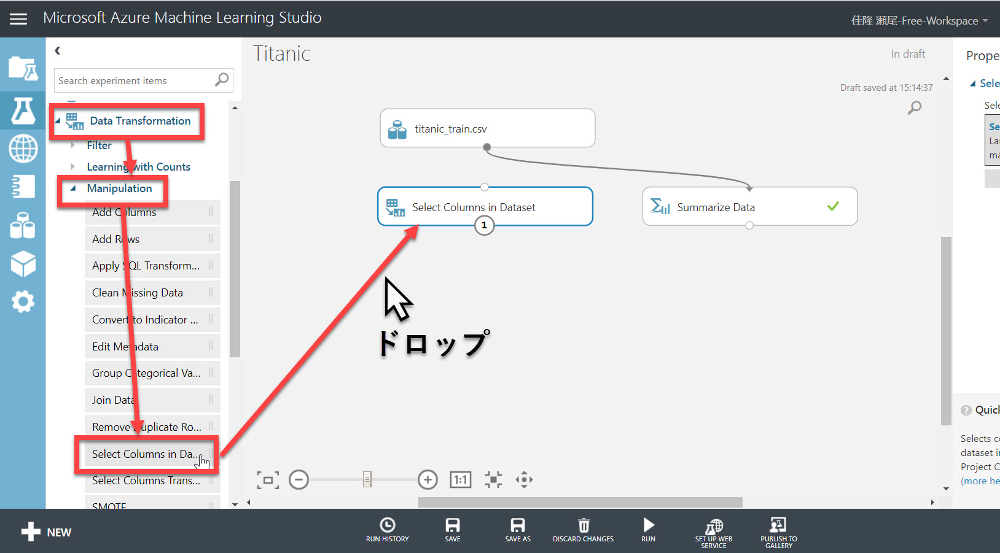
2. "tatanic_train.csv" の下側の出力ノードから "Select Columns in Dataset" の上側の入力ノードにドラッグして、2つの **モジュールを接続** します。  
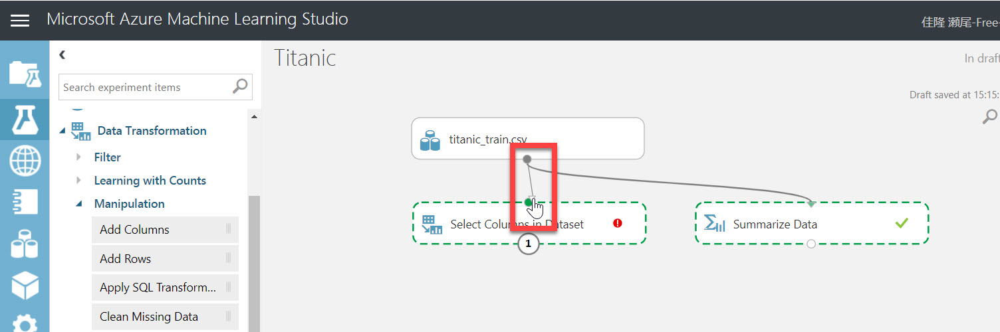  
3. "Select Columns in Dataset" を選択して、Properties の [**Launch column selector**] をクリックします。  
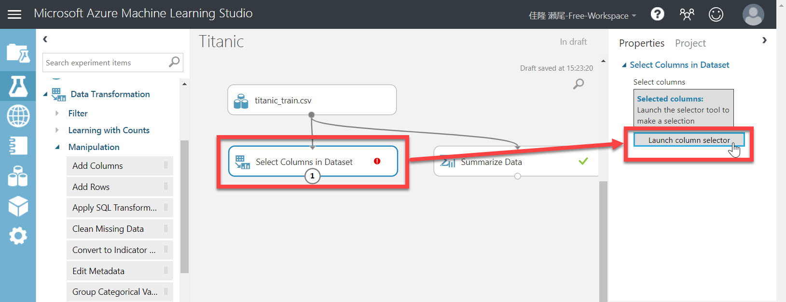  
4. [Select Columns] で以下の列を選択して、"Selected Columns" に移動する。さらに [OK] をクリックして選択を確定します。

   - Survived
   - Pclass
   - Sex
   - Age
   - SibSp
   - Parch
   - Fare

     
   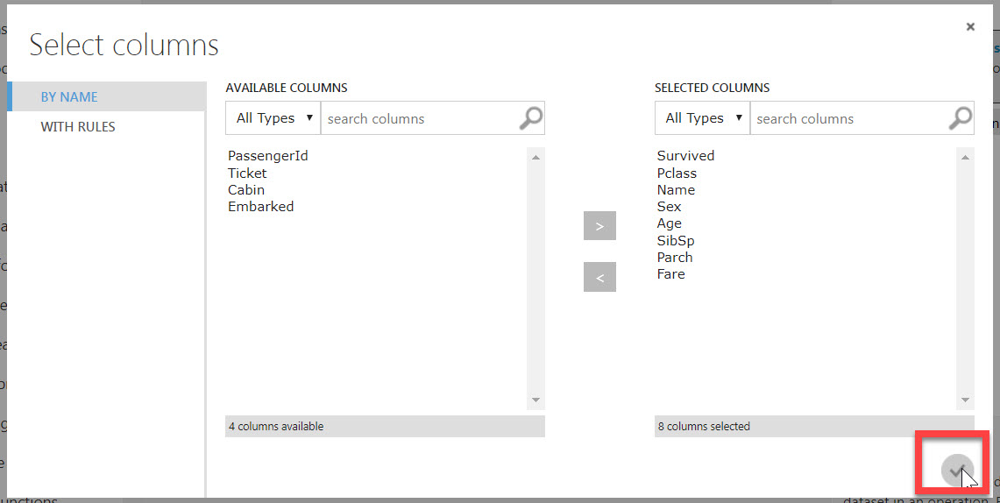  
5. [Run]-[Run Selected] で、"Select Columns in Dataset" モジュールを実行します。  
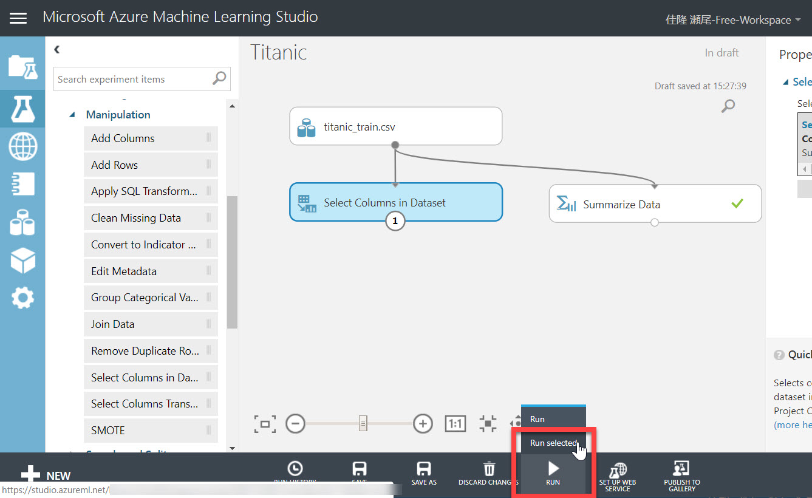

   > モジュール一覧から **モジュールを Experiment にドロップ** する操作、および上のモジュールの出力ノードから下のモジュールの入力ノードにドラッグして **接続**する操作、および [Run]-[Run Selected] でモジュールを **実行** する操作は、この後も共通の操作です。  
6. Select Columns モジュールの出力ノードで右クリックして、[Visualize] を選択します。  
  
7. 表示される列が、選択したものだけになっていることを確認します。  
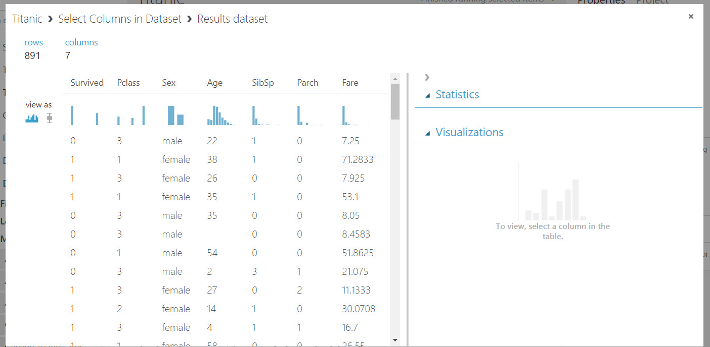

---

## 欠損しているデータを補完する

[データの分析](./02_dataanalyze.md) で見た通り、Age 列は値が空の行が多数あります。  
Age と Survived との間には相関はありそうですが、他の列に比べてそれほど強い相関でもありません。  
今回は、空よりは何か値が入っているほうがいいだろうと考え、空の Age 列には **平均値** を入れることにします。

1. モジュール一覧で、[Data Transformation]-[Manipulation]-[**Clean Missing Data**] を Experiment にドロップします。続いて、"Select Columns in Dataset" の出力ノードと "Clean Missing Data" の入力ノードとを接続します。  
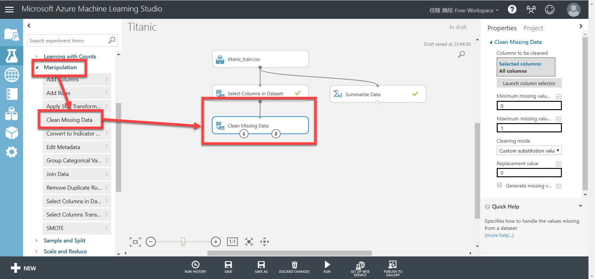  
2. "Clean Missing Data" の Properties で、[**Launch column selector**] をクリックします。  
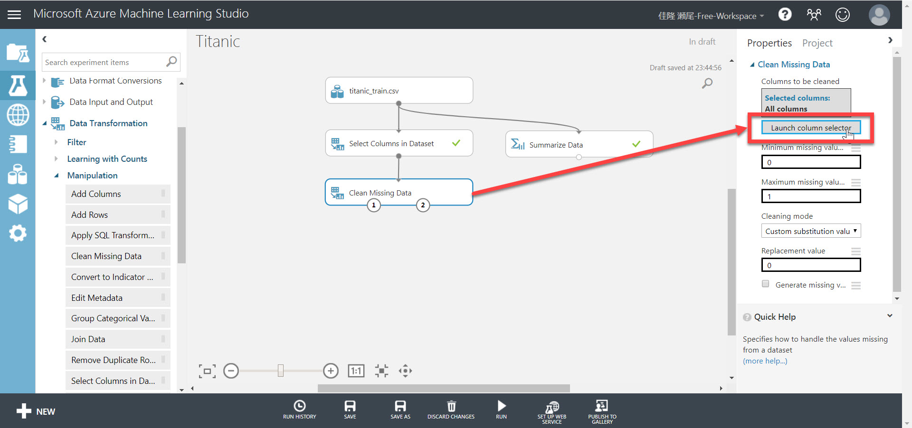  
3. "Select columns" 画面で、[**BY NAME**] をクリック（選択されていない場合）して、"<", ">" ボタンを使って、[**SELECTED COLUMNS**] に "**Age**" だけが入っている状態にします。そのあと [OK] をクリックして確定します。  
  
4. [**Cleaning mode**] で "**Replace with mean**" を選択します。  
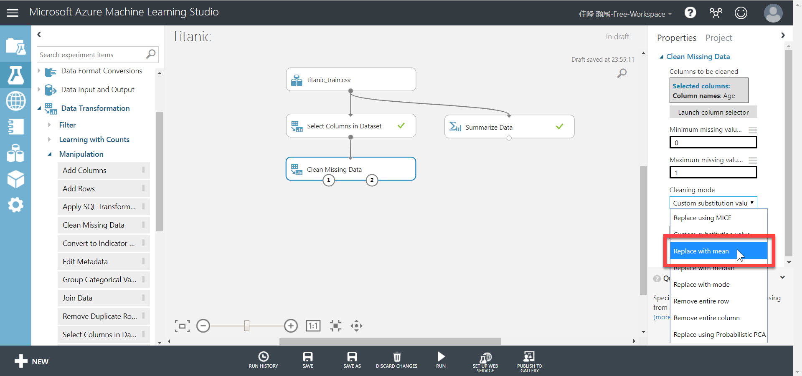  
5. [Run]-[Run selected] で未実行のモジュール（Clean Missing Data）を実行します。
6. "Cleaning Missing Data" モジュールの **左側の出力ノード** で右クリックして、[Visualize] を選択します。
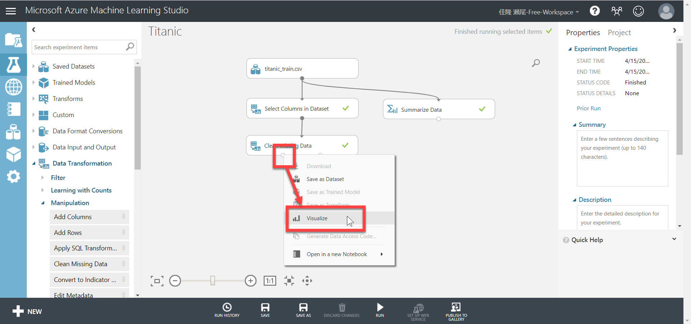  
7. "Age" 列のヘッダーをクリックし、"Missing Value" が 0 になっていることを確認します。今回のデータセットでは、平均値である "29.699118" が入っている行が見つかるはずです。  
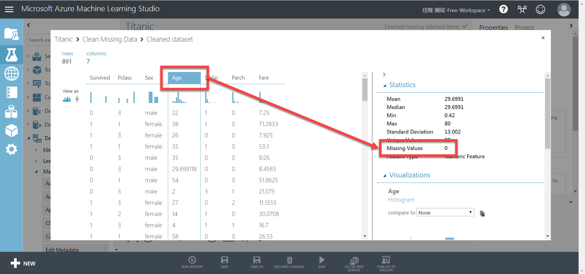

> "Clean Missing Data" モジュールのように、入力ノード、出力ノードを複数持っているモジュールがあります。

---

以上で、データの整形ができました。  
次のステップでは、いよいよ [**学習モデルを作ります**](./04_createmodel.md) 。