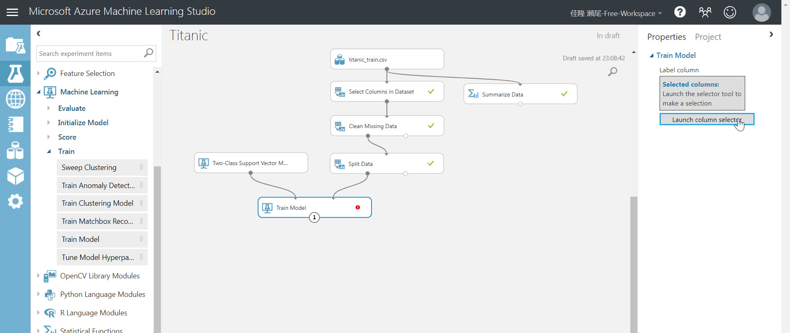
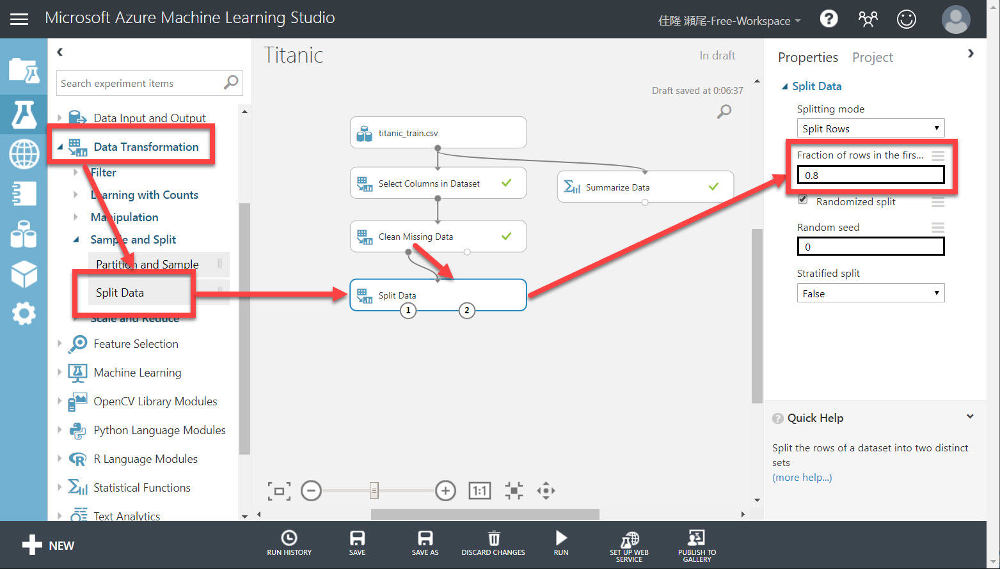
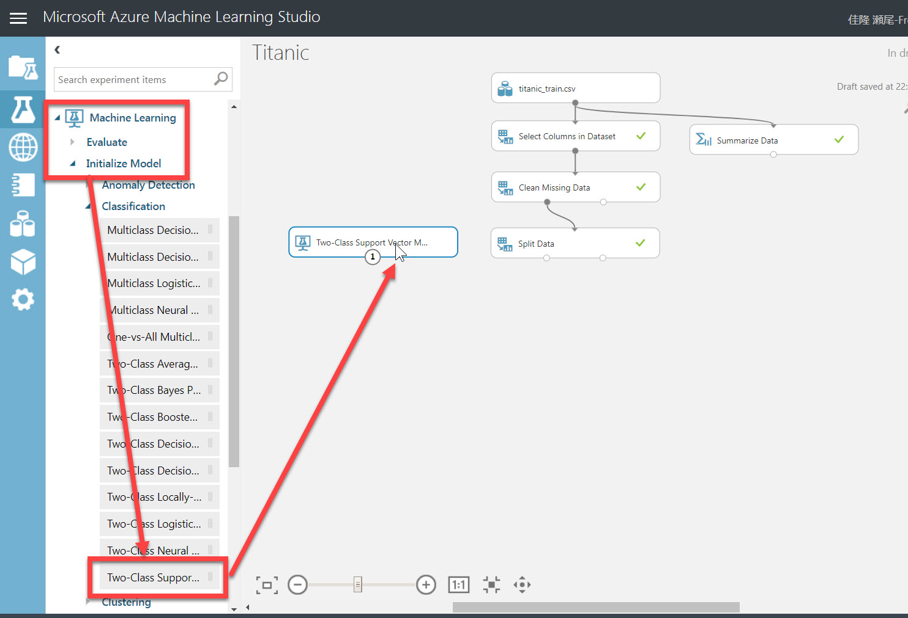
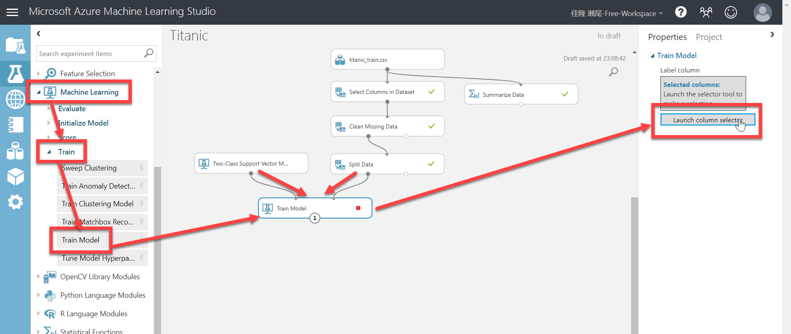
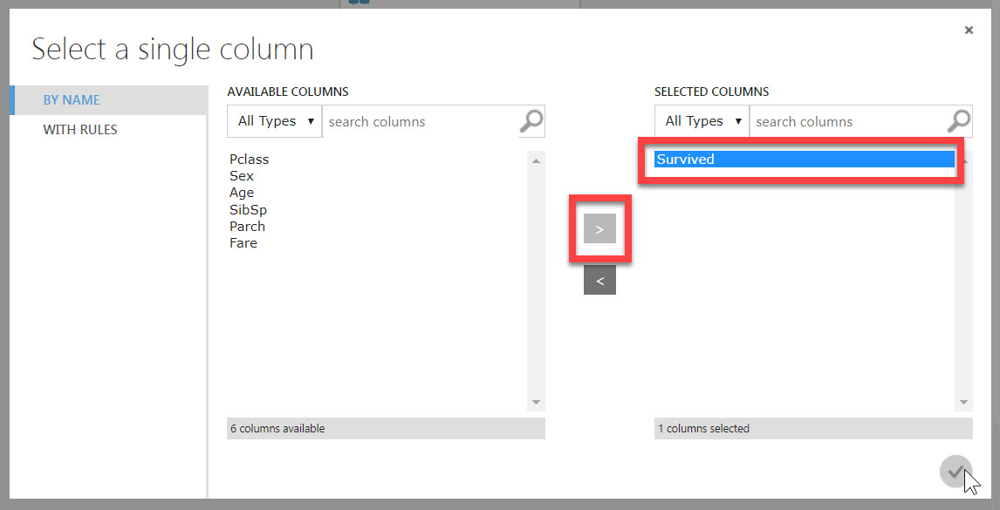

# モデルを作成する

[前のステップ](./03_dataformat.md) までで、データの分析と整形が終わりました。

このステップから、いよいよ **学習モデル** を作成します。まず整形済みのデータセットを **訓練** します。  
（モデルの評価は [次のステップ](./05_evaluatemodel.md) で行います。このステップで行うのは "訓練まで" です）

学習には、 **訓練** 用のデータと **評価** 用のデータが必要です。  
データセット（訓練データ）で訓練することで、モデルは "知能" を獲得します。ただし、それだけではどのくらい "賢くなったか" が分かりません。  
そこで、**訓練に使っていないデータセット** でモデルを評価します。これによって、学習済みモデルがどれだけの精度で予測できるかを数値化できます。

> 訓練に使ったデータセットは評価には使いません。学習済みモデルは訓練用データの正解を知っているからです。

訓練データと評価データとが、あらかじめ分けられていることもありますが、区別なく "**ひとかたまりの**" データセットとして提供されることも多くあります。

そのような場合には、データの整形が終わったところで、データセットを **二組に分けます** 。そのうち一方を訓練に、もう一方を評価に使います。  
データ総数や使用するアルゴリズムにもよりますが、70～80% 程度を訓練用のデータとし、それ以外を評価用のデータとすることが多いように思います。

> 分ける比率は決まっているわけではありません。可能であれば、比率を変えて何度か学習して一番いいモデルを採用します。  
> 繰り返し学習する際には、データ分割の比率だけではなく、アルゴリズムを変えたり、深層学習ではハイパーパラメーター（ミニバッチのサイズやエポック数など・・・ここでは説明を省略します）を変えて何度か学習します。

---

## データを分割する

**データの分割** は以下の手順で行います。

1. モジュール一覧で、[Data Transformation]-[Sample and Split]-[**Split Data**] を Experiment にドロップします。  
2. "Clean Missing Data" の左側の出力ノードと "Split Data" の入力ノードとを接続します。  
3. "Split Data" モジュールの Properties で、[**Fraction of rows in the first output dataset**] を 0.8 に変更します。  
   > ここで指定した "0.8" とは、80% のデータを左側の出力ノードに出力し、残りを右側の出力ノードに出力することを意味します。  
   > Properties の他の項目はデフォルトのままで問題ありません。  

     
4. [Run]-[Run Selected] で "Split Data" モジュールを実行します。
   > 実行後に、"Split Data" の左右それぞれの出力ノードを右クリックして [Visualize] を選択すれば、それそれに出力されたデータを確認することができます。ポップアップの先頭に行数が表示されるので、実際に 80%, 20% にデータセットが分割されたことが分かります。

---

## アルゴリズムの決定

機械学習（深層学習を含む）では、データの他にもう一つ大事なものがあります。  
「**アルゴリズム** ＝データを学習する手順・方法」 です。

選択したアルゴリズムによって、学習モデルの適合度（どのくらい賢いか）が変わってきます。

> 今回使っているタイタニック号の乗船リストはシンプルな構造なので、実際にはそれほど大きな差は生じません。

どのアルゴリズムを使えばいいのかは、[こちらの **チートシート**](https://docs.microsoft.com/ja-jp/azure/machine-learning/studio/algorithm-cheat-sheet) が参考になります。

今回は **Two-class SVM** を使ってみます。

1. モジュール一覧で、[Machine Learning]-[Initial Model]-[Classification][**Two-Class Support Vector Machine**] を Experiment にドロップします。  

---

## モデルを訓練する

アルゴリズムを決定したので、これを使ってデータセットを訓練します。これによって、モデルが知能を獲得します。

1. モジュール一覧で、[Machine Learning]-[Train]-[**Train Model**] を Experiment にドロップします。続いて、"Two-Class Support Vector Machine" の出力ノードと "Train Model" の左側の入力ノードとを接続し、"Split Data" の左側の出力ノードと "Train Model" の右側の入力ノードとを接続します。
2. "Train Model" の [Properties] の [**Launch column selector**] をクリックします。
  
3. ポップアップが開いたら、"**Survived**" を [SELECTED COLUMNS] に入れた状態にします。続いて [OK] をクリックします。  
   > これは **予測対象** が "Survived" であることを意味します。

     
4. [Run]-[Run selected] で未実行のモジュールを実行します。

---

以上でモデルの訓練が終わりました。作成したモデルは知能を獲得しました。  
ただし「どの程度賢いのか」をまだ確認していません。

次のステップでは、[**学習済みモデルを評価**](./05_evaluatemodel.md) します。