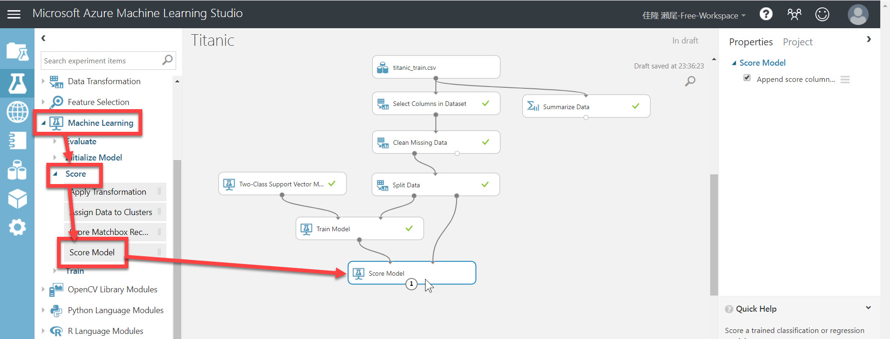
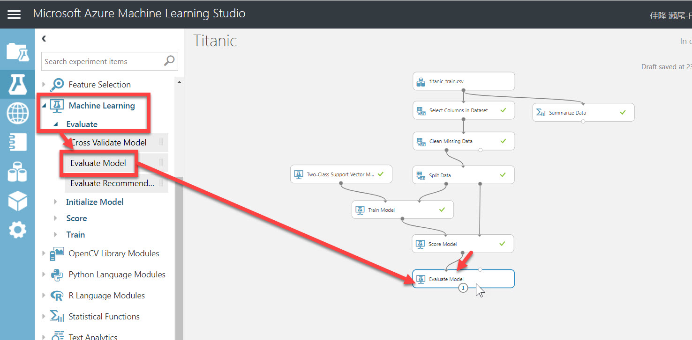
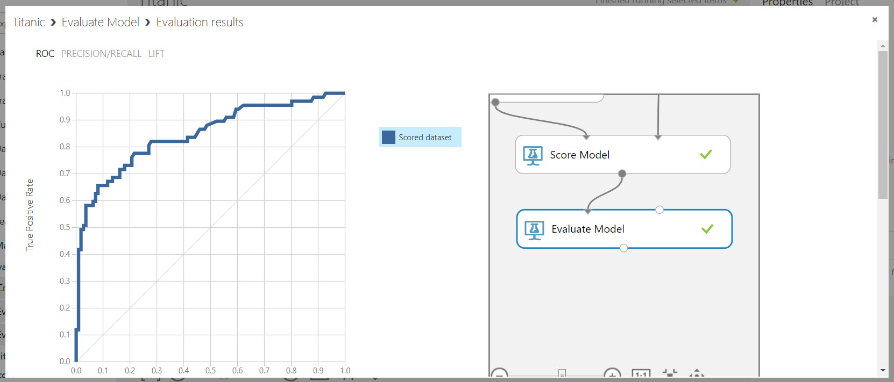
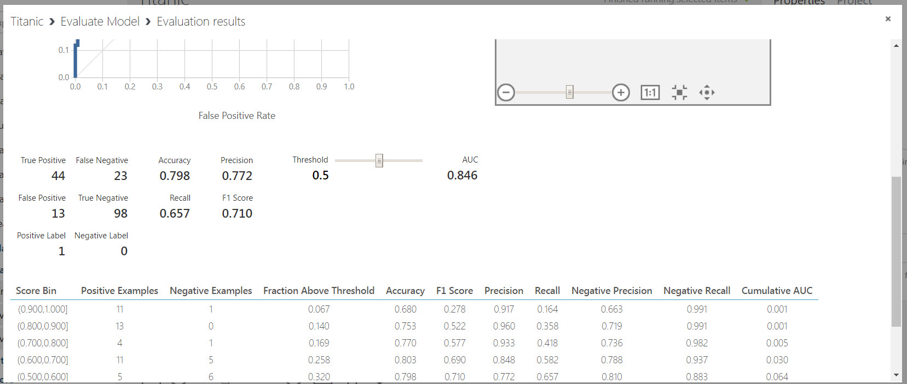
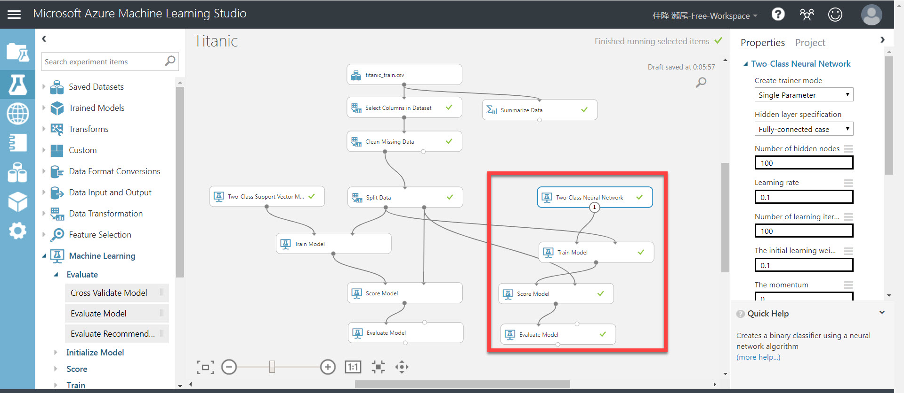
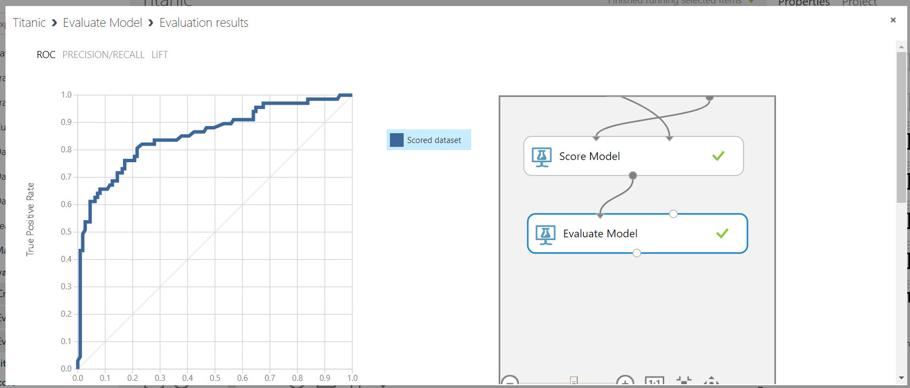
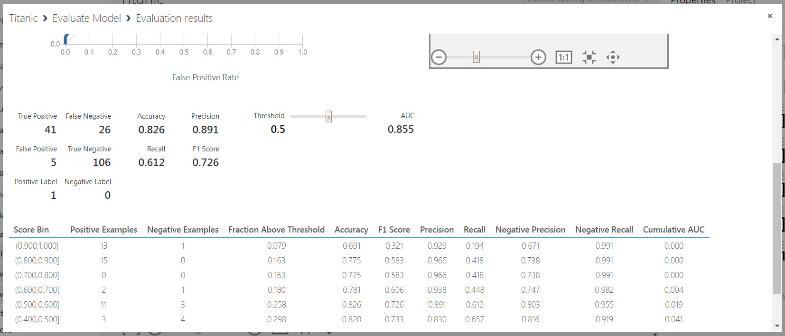
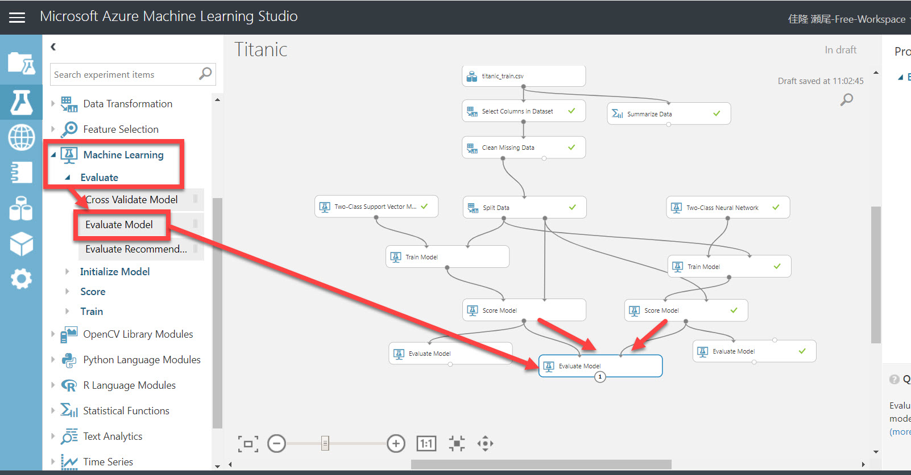
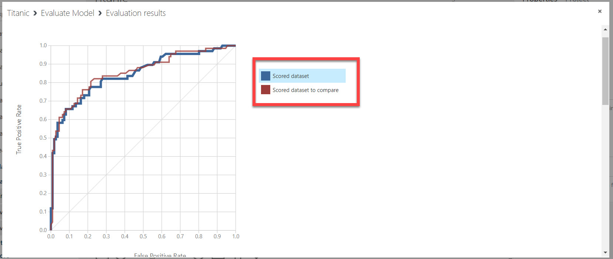

# 学習済みモデルを評価する

前のステップで [訓練](./04_createmodel.md) が終わったので、ここからは、このモデルを評価します。つまり、モデルの "賢さ" を確認してみます。

1. モジュール一覧で、[Machine Learning]-[Score]-[**Score Model**] を Experiment にドロップします。続いて、"Train Model" の出力ノードと "Split Data" の右側の入力ノードとを接続します。  
  
   > 評価には、**学習には使用していないデータセット** が必要です。  
   > 元々のデータセットを 4:1 (80%と20%) とに分けておいたデータが残っています。評価ではこのデータセットを使います。これが "Split Data" モジュールの右側の出力ノードから出てくるデータセットです。
2. [Run]-[Run selected] で未実行のモジュールを実行します。[Score Model] の出力ノードを右クリックして、[Visualize] を選択します。
3. モデルのスコアが表示されます。  
**Survived** が求めるべき値、**Scored Labels** が学習済みモデルが予測した値です。  
  

   > ざっと見ると正解しているものが多そうですが、定量的ではありません。そこで次の操作に進みます。

4. モジュール一覧で、[Machine Learning]-[Evaluate]-[**Evaluate Model**] を Experiment にドロップします。続いて、"Score Model" の出力ノードと "Evaluate Model" の左側の入力ノードとを接続します。  
  
5. [Run]-[Run selected] で未実行のモジュールを実行します。[Evaluate Model] の出力ノードを右クリックして [Visualize] を選択します。  
結果画面には **ROC 曲線** が表示されます。詳しい説明は省略しますが、曲線の下側の面積が大きいほど学習モデルが "賢く"、傾きが 45度の直線に近いほど "賢くない" ことを意味します。  
  
結果画面を下にスクロールするといくつかの数値が表示されています。  
まずは "**Accuracy**" と "**F1 Score**" に注目するとよいでしょう。どちらも **1 に近いほど** 優秀なモデルであることを意味します。"Accuracy" はモデルの "精度" を表します。"F1 Score" は総合的な "成績" を表します。  
  

   > Accuracy が 0.798 ならば、80% 程度は正しい予測ができるモデルだと言えます。
   > モデルの用途によっては、"Precision" と "Recall" の値も気にかける必要があります。

ここまでが **訓練の一連の操作** です。  
ただし、どのくらい優秀だと言えるのか、より優秀なモデルは作れないのか、など疑問が残ります。  
そこで続いて、同じデータセットを **別のアルゴリズム** で訓練して、比較してみます。

---

## 別のアルゴリズムでモデルを訓練する

別のアルゴリズムで、今回のデータセット（Split Dataした後のデータセット）を訓練してみます。

手順は [**前のステップ**](./04_createmodel.md) の

- アルゴリズムの決定
- モデルを訓練する
- モデルを評価する

と同様ですが、使用するアルゴリズムは **Two-Class Neural Network** (モジュール一覧で、[Machine Learning]-[Initial Model]-[Two-Class Neural Network]) にします。

"Evaluate Model" で "Visualize" すると、今回のアルゴリズムで訓練したモデルの評価結果が表示されます。

二つのモデルのAccuracy, F1 Score を比較してみます。

|モデルで使用したアルゴリズム|Accuracy|F1 Score|
|---|---|---|
|Two-Class Support Vector Machine|0.798|0.710|
|Two-Class Neural Network|0.826|0.726|

"Two-Class Neural Network" を使ったモデルのほうが優秀であることが分かりました。

> 数値だけの比較では Two-Class Neural Network が優秀だというだけで、常にこちらを使うべきということではありません。  
> 目的や用途に応じて、Two-Class Vector Machine を使うほうが良い、または使ってもよいということはあります。
> 目的を満たすのであれば、もっともスコアが高いモデルである必要はないということです。

---

## 二つのモデルを視覚的に比較する

二つのモデルについて、Accuracy, F1 Score の数値を比較しました。

視覚的に、もう少し分かりやすく比較してみましょう。

1. モジュール一覧で、[Machine Learning]-[Evaluate]-[**Evaluate Model**] を Experiment にドロップします。
2. 一方の "Score Model" (Two-Class Support Vector Machine から接続されたもの) の出力ノードと "Evaluate Model" の **左側の入力ノード** とを接続します。
3. もう一方の "Score Model" (Two-Class Neural Network から接続されたもの) の出力ノードと "Evaluate Model" の **右側の入力ノード** とを接続します。  
  
4. [Run]-[Run selected] で未実行のモジュールを実行します。最後に置いた [Evaluate Model] の出力ノードを右クリックして [Visualize] を選択します。  
二つのモデルの ROC 曲線が表示されます。部分的に逆転している箇所がありますが、**右側の入力ノード** (Two-Class Neural Network から接続されたもの) のほうがグラフが上になっているのが分かります。

---

ここまでで、学習モデルを [作成](./04_createmodel.md) し、どの程度 "賢い" のかを評価しました。

次のステップでは、作成した学習モデルを Web サービスとしてクラウドの発行します。  
せっかく作ったモデルなので、サービスとして利用できるようにしましょう。