# 予測モデル（学習済みモデル）を発行する

前のステップで [モデルの評価](./05_evaluatemodel.md) しました。

ここから、学習済みの予測モデルを **クラウドに発行** して Web サービスとしてクライアントから利用できるようにします。

---

## Experiment 全体を実行する

Web サービス化するメニュー項目が無効化されているかもしれません。Web サービスを作成するには、メニュー項目を有効にしなければなりません。  
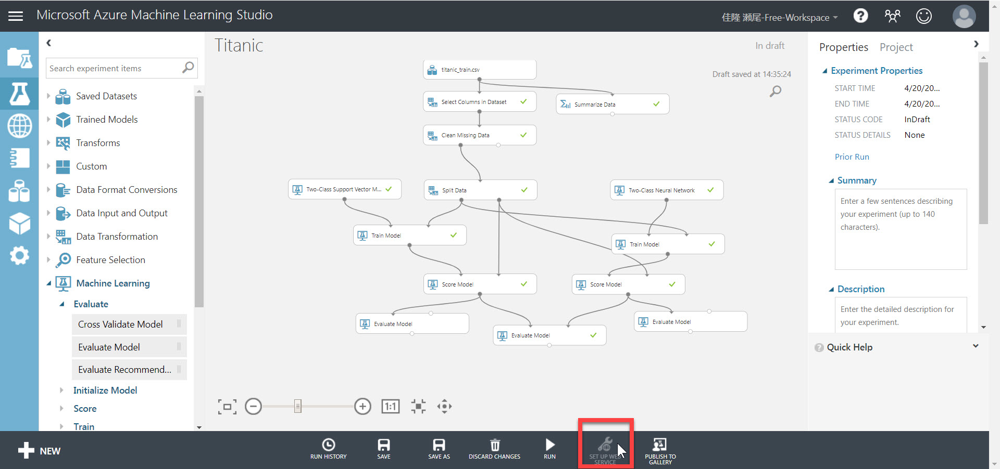

1. メニュー項目を有効にするには、Experiment **全体を改めて実行** します。  
[Run]-[Run] で Experiment 全体を実行できます。  
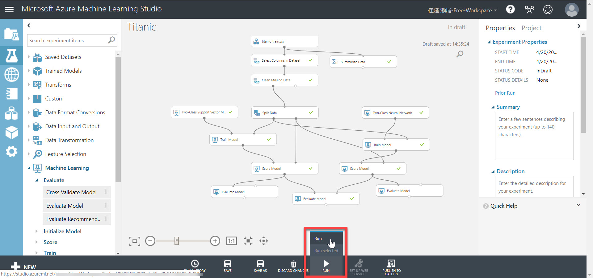  
2. Experiment 全体の実行が完了すると、Web サービス化のメニューが有効されることを確認します。  
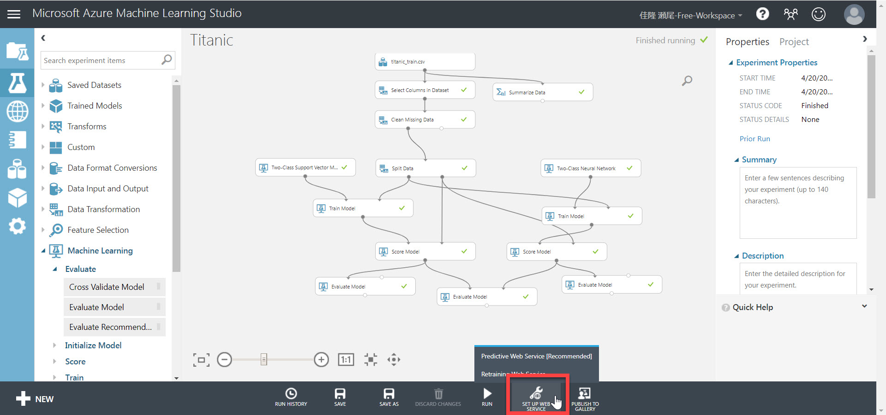

---

## 予測モデルを自動作成する

Web サービスとして発行するためには、**予測モデル** を作成します。

予測モデルは、学習済みモデルから自動的に生成できます。  
ただし自動生成された予測モデルは、一般には一部変更する必要があります。

1. "Two-Class Neural Network" から接続された **Train Model** モジュールを選択します。  
   > Experiment に複数の Train Model を配置している場合は、どちらの Train Model を Web サービス化するかを選択します。

   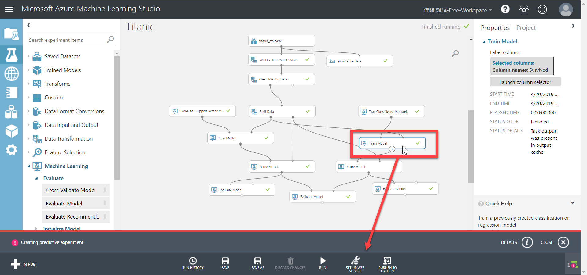  
2. ウィンドウ下部の [SET UP WEB SERVICE]-[Predictive Web Service \[Recommended\]] を選択します。

   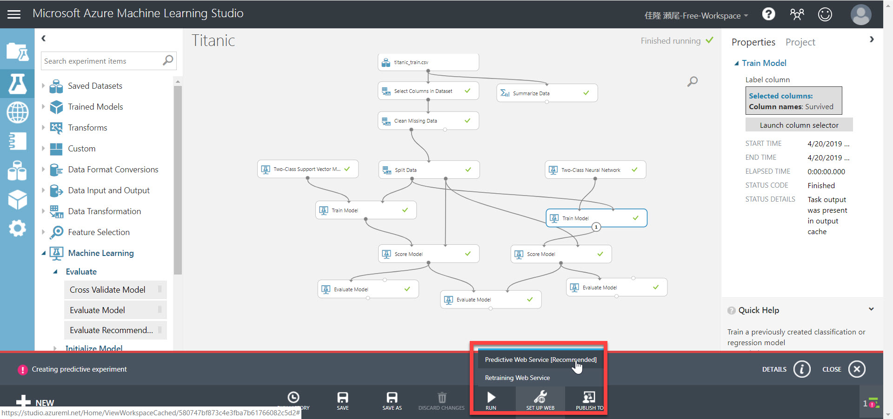
3. 少し待つとWeb サービスが自動生成されます。  
この時点では、Web サービスはまだクラウドへは発行されていません。  
   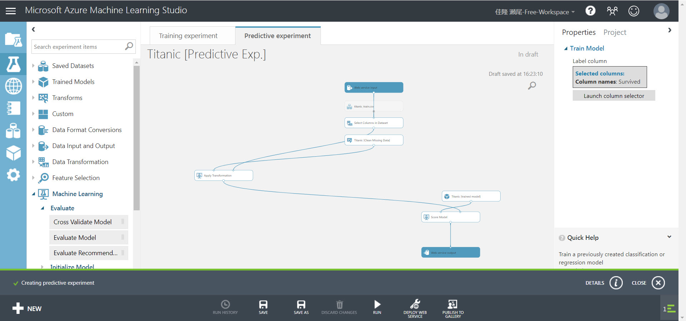

---

## 予測モデルを変更する

自動生成された予測モデルでは、予測モデルへの入力（**Web service input**）は "Select Columns in Dataset" に接続されています。  
この場合は、今回の学習に使用しなかった列（PassengerId, Name など）もWeb サービスのパラメーターとして渡さなければなりません。

1. "**Web service input**" の接続を変更します。  
"Web service input" と "Select Columns in Dataset" との間の接続を選択します。続いて、**Del キー** を押して、接続を削除します。

   > 見やすいように各モジュールの位置を変更してもかまいません。  

   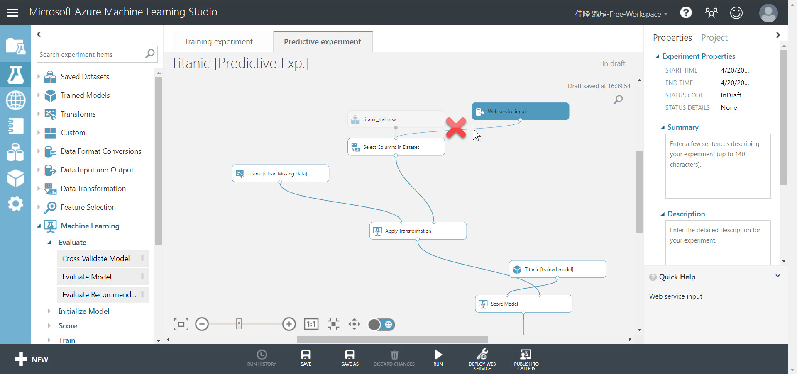  
2. "Web service input" の出力ノードと "**Apply Transformation**" の入力ノードとを接続します。  
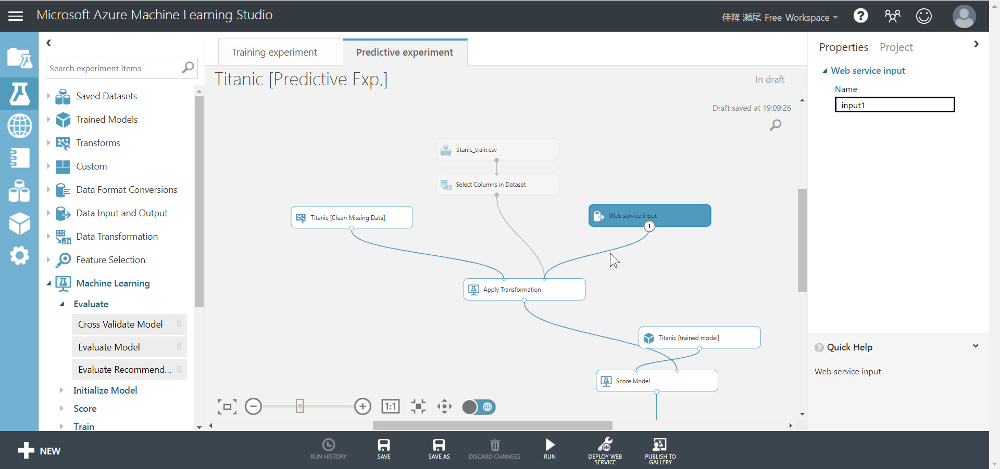  
3. [Select Columns in Dataset] モジュールを選択して、Properties の [Launch column selector] をクリックします。  
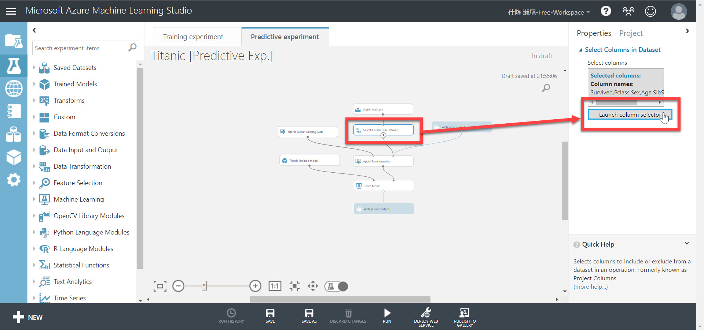  
4. "SELECTED COLUMNS" にある "**Survived**" を選択して [\<] をクリックします。Survived 列が "AVAILABLE COLUMNS" に移動します。最後に [ok] します。

   > "Survived" 列を削除するのは、Survived は予測対象の列だからです。Web サービス呼び出しのパラメーターとして Survived を渡す必要はありません。

   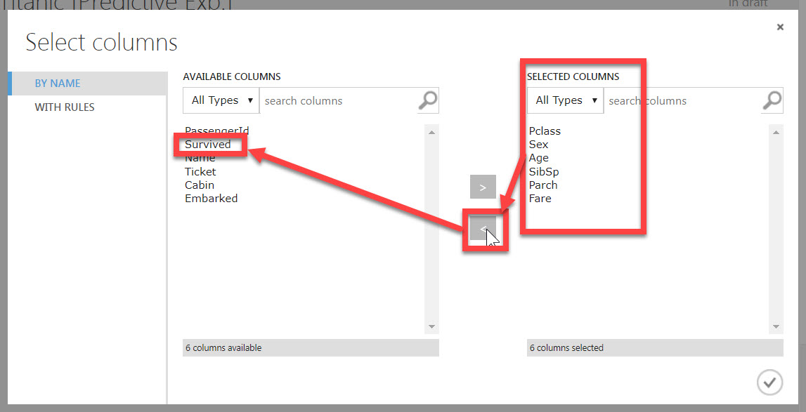
5. [Run]-[Run] で全体を実行します。

これで、Web サービス化する予測モデルが完成しました。

---

## Web サービスを発行

予測モデルをクラウドに発行します。

1. [**DEPLOY WEB SERVICE**] をクリックします。  
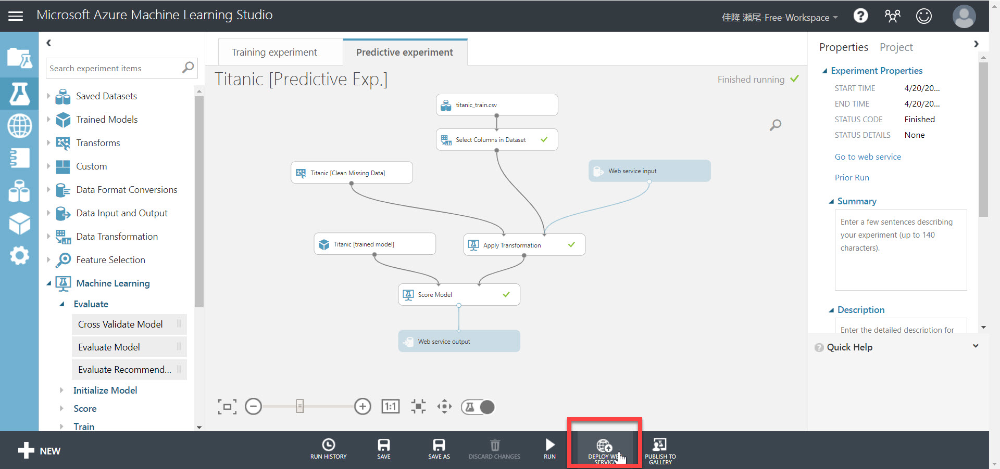  
2. 自動的に **Web Service** 画面に遷移します。  
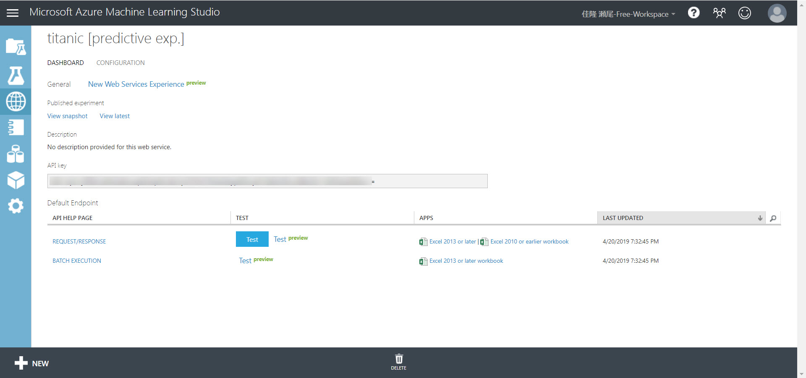

以上で、クライアントから Web サービスを利用できるようになりました。

[次のステップ](./07_requestservice.md) で、実際にクライアントから Web サービスを呼び出してみます。