# 発行したサービスを利用する

[前のステップ](./06_deploymodel.md) で、予測モデルをクラウドに発行しました。

ここからは、発行した Web サービスを呼び出してみます。

---

## Azure Machine Learning Web Services ポータルからリクエスト

最初に Web サービスの動作確認を兼ねて、**Azure Machine Learning Web Services** ポータルからリクエストします。

1. [前のステップ](./06_deploymodel.md) から続けて操作している場合は、Machine Learning Studio の **Web Service** 画面が表示されているはずです。  
  [**Test preview**] をクリックします。  
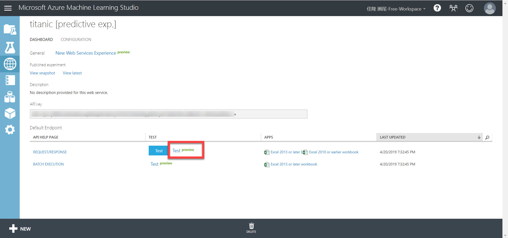  

   > 一度 Machine Learning Studio を閉じていた場合などは、Machine Learning Studio の [**WEB SERVICES**] メニューを選択して、 "**Titanic [Predict Exp.]**" をクリックすると、上の画面に遷移できます。  

   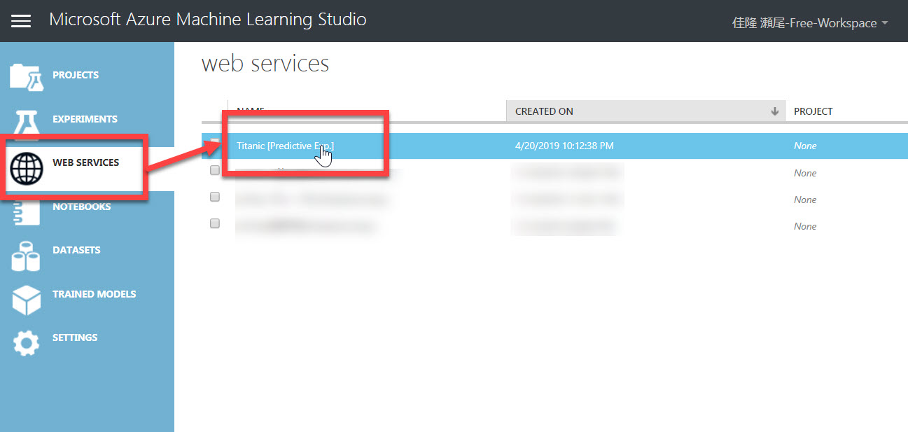  

2. Azure Machine Learning Web Services ポータルが表示されるので、[**Test endpoint**] を選択します。  
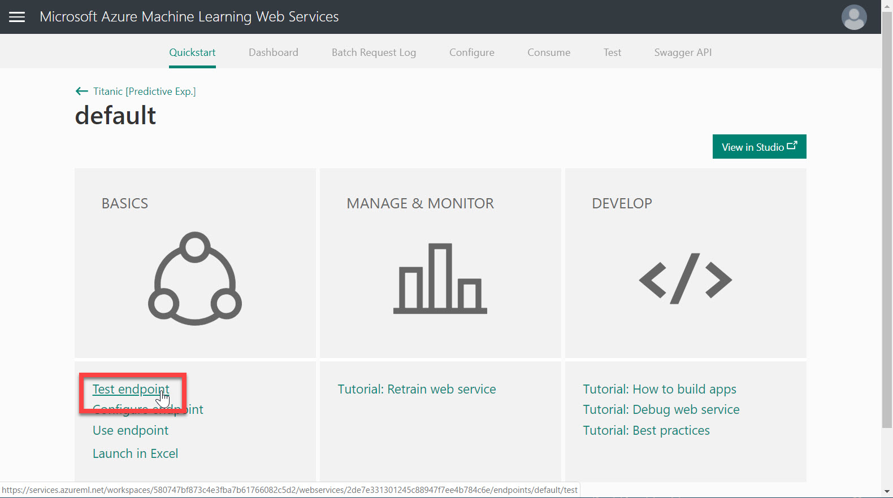  
3. **Test Endpoint ページ** が開きます。  
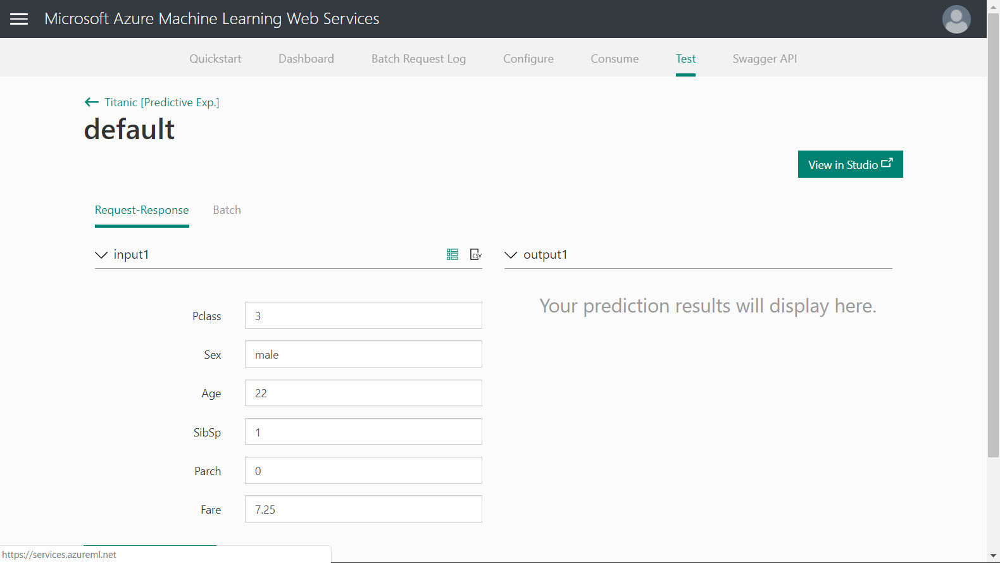
4. [**データを用意する**](./01/preparedata.md) 手順でダウンロードした **test.csv** データを、Excel などで開きます。
テストに使用する任意の行を決めます。（何行目でもかまいません）  
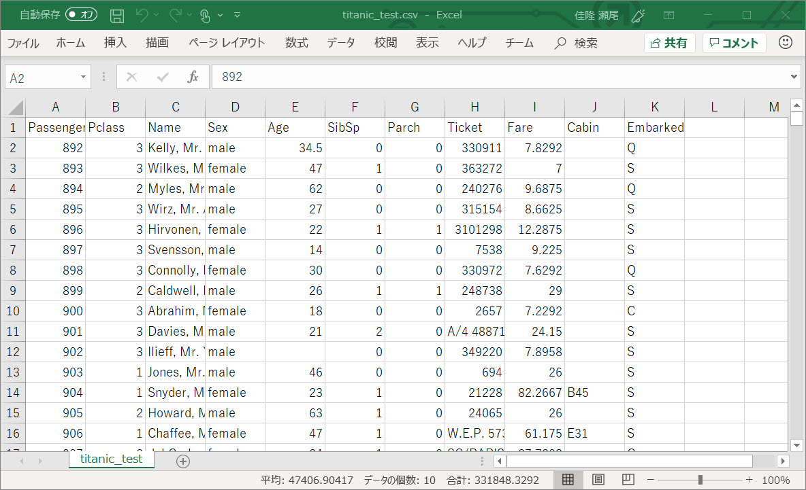  
5. ポータルの Test Endpoint ページで、各パラメーターにテストデータを入力して、[**Test Request-Response**] をクリックします。  
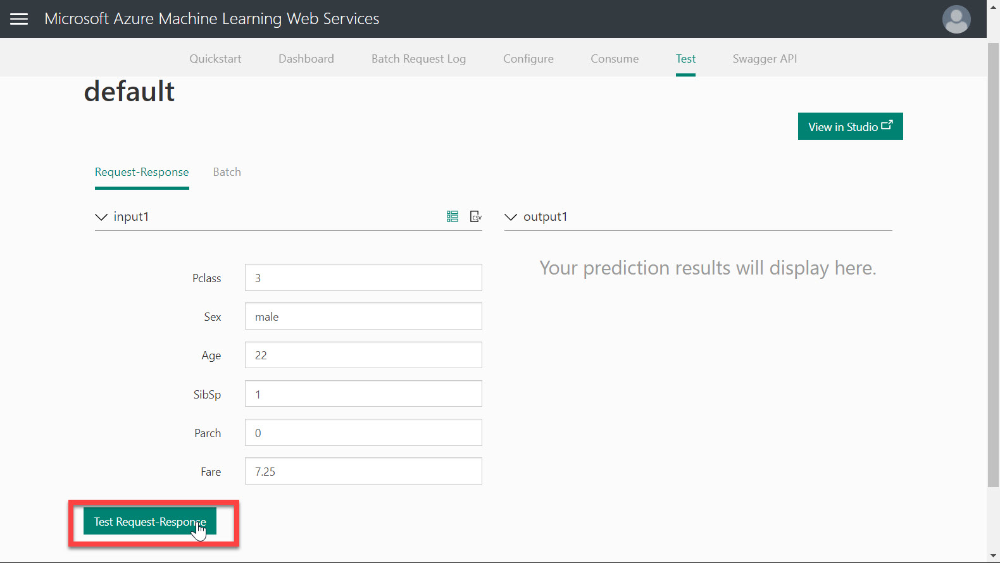  
6. 予測モデルの Web サービスから応答が返ってきます。"**Scored Label**" が予測した値です。  
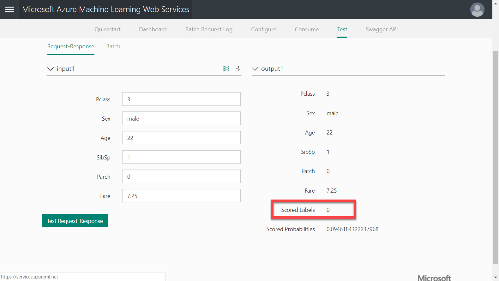

いくつかのデータを試してみて、Web サービスが動作していることを確認します。

---

## Excel からリクエスト

Machine Learning Studio の [**Web Services**] ページでは、クライアントとしてあらかじめ **Excel** が用意されています。  
この Excel から Web サービスを呼び出してみます。

1. Machine Learning Studio の Web Service 画面を表示します。 [**Excel 2013 or later**] をクリックします。  
確認画面が出た後で [**名前を付けて保存**] ダイアログが開くので、PC に保存します。
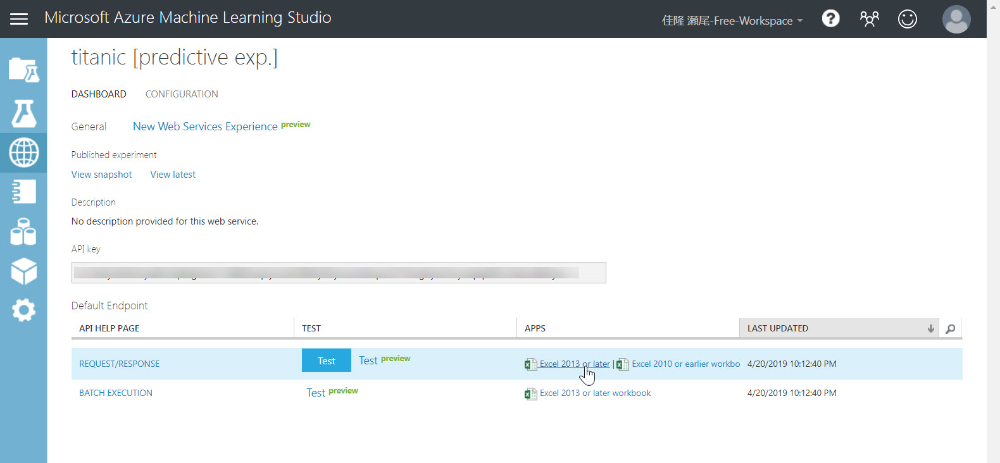  
2. 保存した Excel ファイルを開きます。  
[**Azure Machine Learning**] 作業ウィンドウで、[**Titanic \[Predict Exp.\]**] をクリックします。  
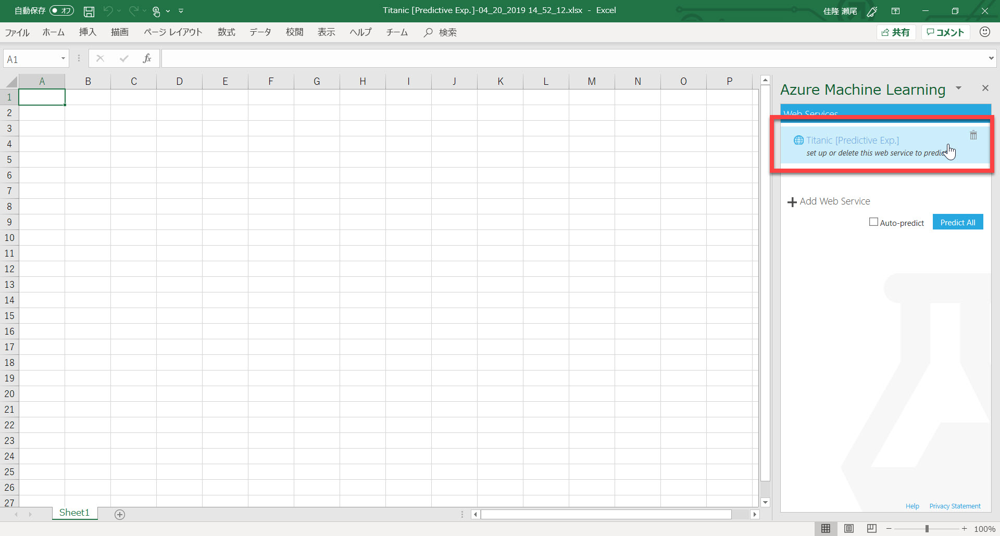  
3. [**Use sample data**] をクリックします。自動的にサンプルデータが Excel のシート上に表示されます。  
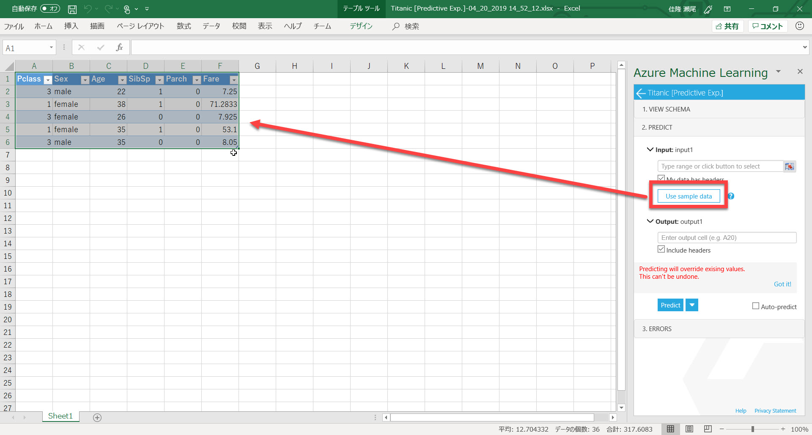  
4. [**Input**] にデータを置いたレンジを指定します。例えば、"**Sheet1!A1:F6**" のように指定します。  
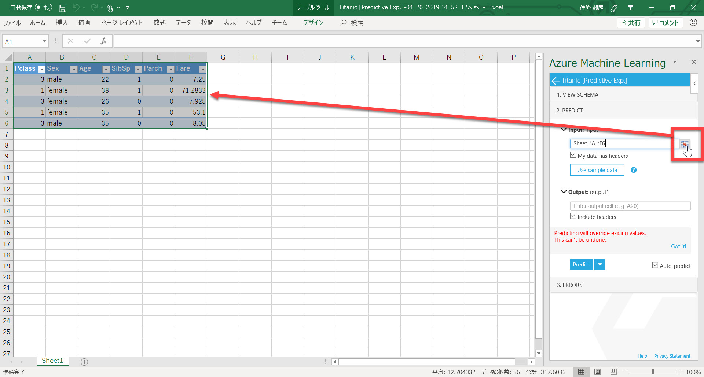
5. [**Output**] に、予測結果を出力するレンジの左上のセルを指定します。例えば、"**H1**" のように指定します。続いて、[**Predict**] ボタンをクリックします。  
   > デフォルトでは "Auto-predict" がチェックされているはずです。もし外れていたらチェックしてから [Predict] をクリックしてください。

   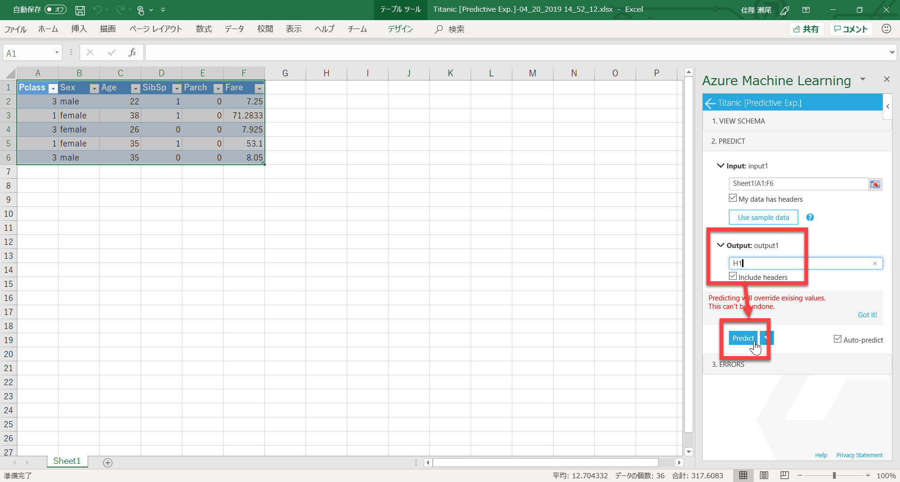  
6. 指定したレンジに応答が表示されます。"**Scored Label**" が予測した値です。  
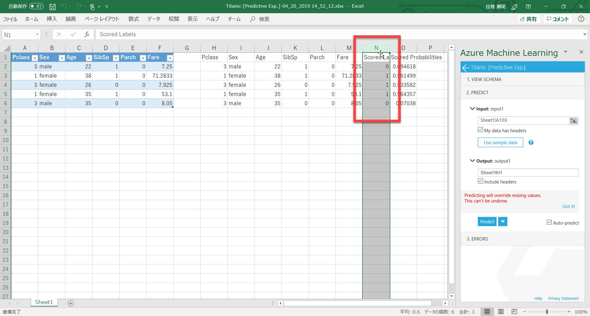

入力は 5行である必要はありません。test.csv のデータも利用して挙動を確認してみてください。

---

## Postman からリクエスト

[**Postman**](https://www.getpostman.com/downloads/) は Web API 開発環境です。
Postman から今回の Web サービスを呼び出してみます。

1. まだ持っていない場合は、[**Postman**](https://www.getpostman.com/downloads/) をダウンロード、インストールします。  
2. Machine Learning Studio の Web Service 画面を開きます。  
3. [**New Web Services Experience**] をクリックします。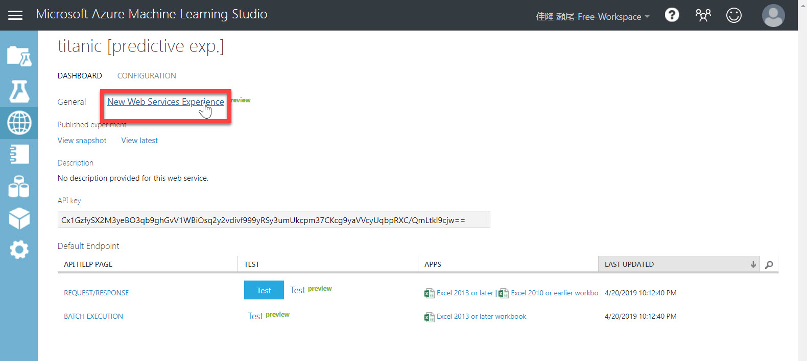  
4. [**Use endpoint**] をクリックします。  
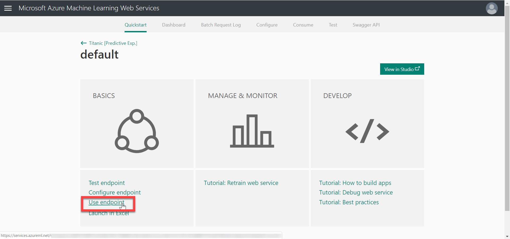  
5. [Consume] ページの [**Request-Response**] にある [**API Help**] をクリックします。  
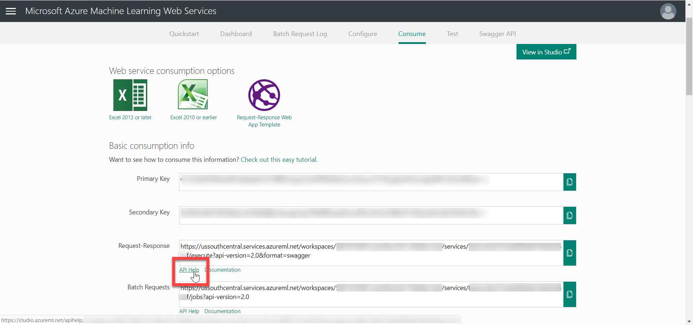  
6. "**Request Response API Documentation**" ページが開きます。このページの情報を参考に、Postman に必要な情報を埋めていきます。（以下、このページを API Document と呼びます）  
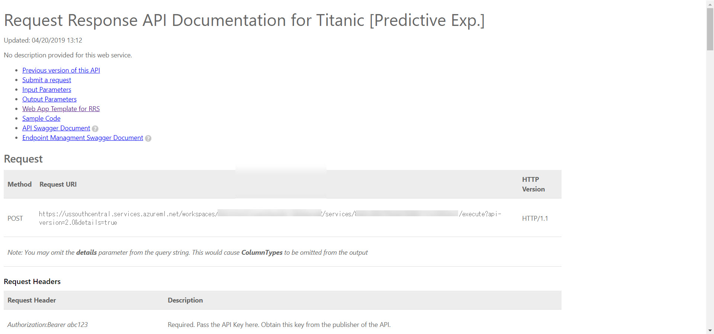  
7. Postman に以下の入力をします。  
   |区分|項目|値|
   |---|---|---|
   |リクエスト|メソッド|POST|
   |リクエスト|URL|API Document の **Request-Response**|
   |Headers|Authorization|"Bearer " + API Document の **Primary Key**|
   |Header|Content-Type|application/json|
   |Body|("Raw" に切り替えて)|API Document の **Sample Request**|

   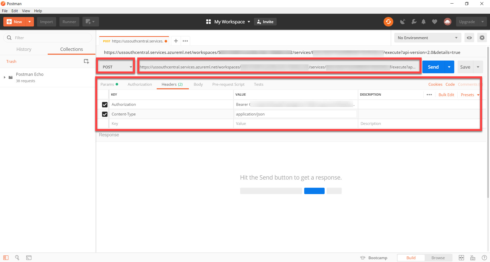  
   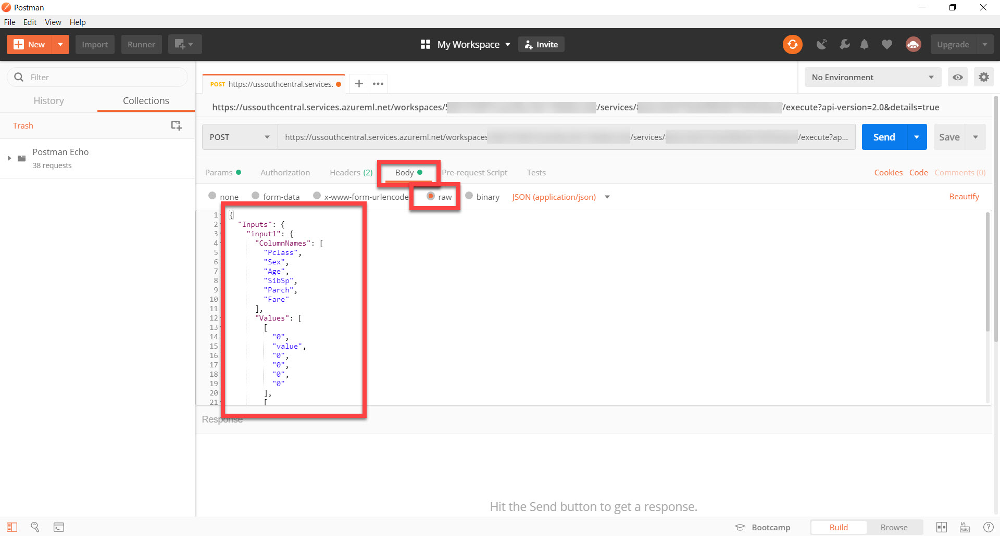  
8. [**Send**] をクリックします。入力が正しければ応答が返ってきます。  
**Values** の **Scored Labels** の位置（Values の下から２個目の "1" または "0" の値）が予測した値です。
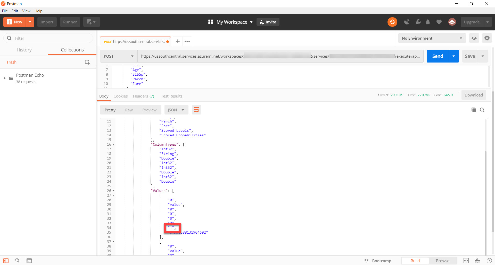

---

以上で、このコンテンツはすべて終了です。

機械学習のデータの用意、学習、クラウドへの発行、クライアントからの利用について、実際に操作してみました。  
[公式の Quickstart](https://docs.microsoft.com/en-us/azure/machine-learning/studio/create-experiment) など他の資料も参照して、機械学習の理解を深めてください。

このコンテンツへの意見、改善の提案などは Github の Issue, Pull request でお知らせください。

---

## 参考資料

- [Azure Machine Learning Studio](https://studio.azureml.net/)
- [Machine Learning Studio Documentation](https://docs.microsoft.com/en-us/azure/machine-learning/studio/)
- [機械学習アルゴリズム チート シート](https://docs.microsoft.com/ja-jp/azure/machine-learning/studio/algorithm-cheat-sheet)
- [Kaggle](https://www.kaggle.com/c/titanic)