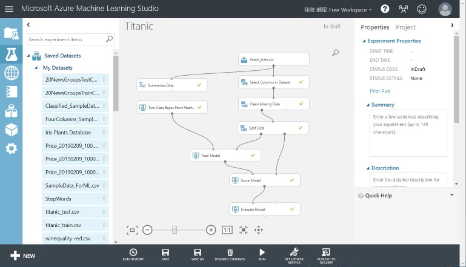

# Azure Machine Learning Studio で二項分類 ～ タイタニック号から脱出できるか？

このコンテンツでは、[**Azure Machine Learning Studio**](https://studio.azureml.net/) を使って **二項分類** を行う手順を紹介します。

このコンテンツのテーマは、[**タイタニック号の乗船リスト**](https://www.kaggle.com/c/titanic/) から、どのような属性の人が **"助かる" かを予測** することです。

---

クラウドや PC の性能が向上して、言語やツールが進歩したことから、**深層学習** が普及してきました。

しかし、**構造化データ**（Excel や CSV のような表形式の構造を持つデータ）を学習する場合は、むしろ深層学習ではない **機械学習** のほうが適していることがあります。  
AI 技術を理解する上でも、シンプルな機械学習のほうが直感的で理解しやすいでしょう。初心者・入門者はまず機械学習で感覚をつかみ、あとで深層学習に進むとスムーズに進められそうです。

---

今回は、データセットを単に **学習** するだけではなく、学習済みモデルを **クラウドに発行** して、そのサービスを **利用** する手順まで紹介します。

開発には [Azure Machine Learning Studio](https://studio.azureml.net/) を使用します。  

機械学習（深層学習でも基本的には同様）は、以下の流れで進めます。  

1. [データを用意する](./01_preparedata.md)
2. [データを分析する](./02_dataanalyze.md)
3. [データを整形する](./03_dataformat.md)
4. [モデルを作成する](./04_trainmodel.md)
5. [学習済みモデルを評価する](./05_evaluatemodel.md)
6. [予測モデル（学習済みモデル）を発行する](./06_deploymodel.md)
7. [発行したサービスを利用する](./07_requestservice.md)

> このコンテンツでは、Azure Machine Learning Studio の **FREE レベル** を利用します。  
Azure Machine Learning Studio の STANDARD レベル（有償）を利用すると、複雑なモデルを開発したり高速に学習したりすることができます。Azure Machine Learning Studio のレベルの差は [こちら](https://azure.microsoft.com/ja-jp/pricing/details/machine-learning-studio/) を参照してください。  
STANDARD レベルでこのコンテンツを利用したい場合は、 [STANDARD レベルの Workspace 作成手順](./a01_createworkspace.md) で Workspace を作成してから、上記の手順で進めてください。

---

間違いや更新の提案は、Issue、Pull Request でお知らせください。