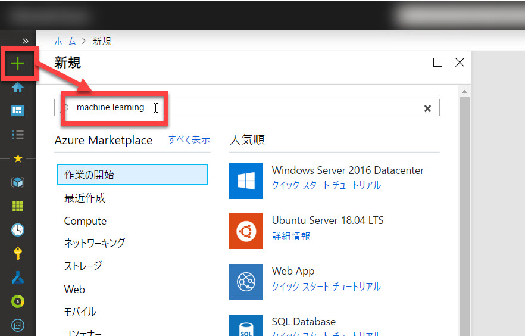
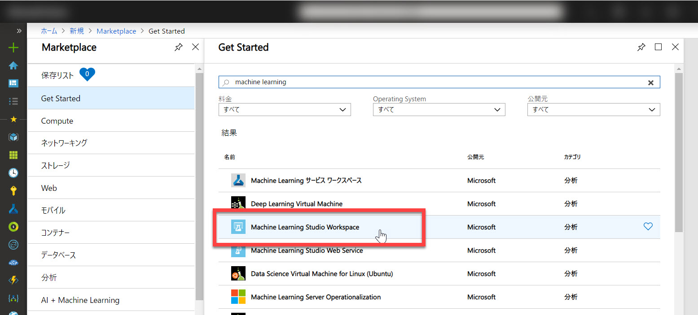
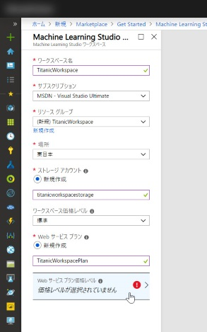
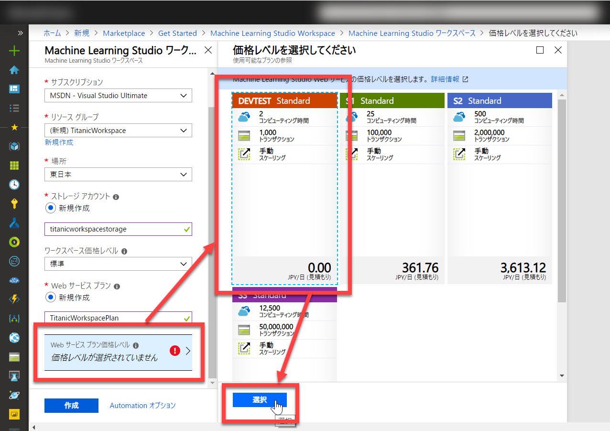
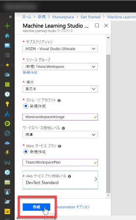
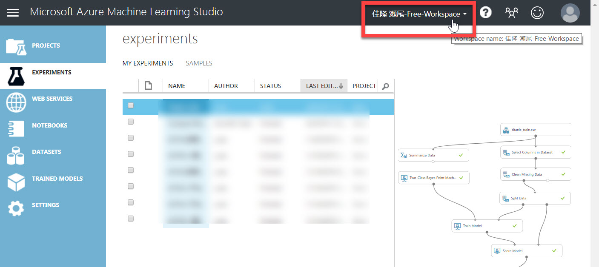
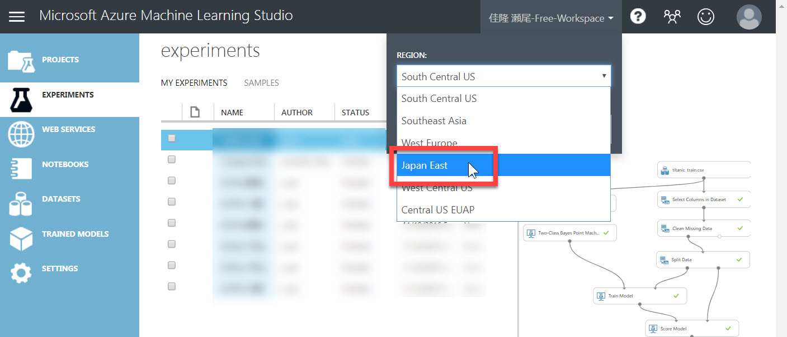

# (参考) STANDARD レベルの Workspace 作成手順

このコンテンツは　Azure Machine Learning Studio の FREE レベルで実行可能です。  
しかし有償の STANDARD レベルを利用すると、複雑なモデルを開発したり高速に学習したりできます。

このコンテンツを STANDARD レベルの Workspace (作業場所) を使って実施したい場合は、以下の手順で Workspace を Azure 上に作成します。  
※以下の手順を進めるには、Azure のサブスクリプション（無償評価版でも可）が必要です。

今後のために、有償の Workspace の作り方を知りたい場合も以下の手順を参照してください。

---

## Azure ポータルでの操作

1. [Azure ポータル](https://portal.azure.com/) にサインインします。
2. [リソースの作成] をクリックして、検索ボックスに "**machine learning**" と入力します。
     
3. 検索結果から **Machine Learning Studio Workspace** を選択します。
  
4. Workspace の設定を入力します。

   |項目名|値|
   |---|---|
   |ワークスペース名|任意 (ここでは "TitanicWorkspace")|
   |サブスクリプション|リソースを作成するサブスクリプション|
   |リソースグループ|任意 (ここでは "TitanicWorkspace"、新規作成するには [**新規作成**] をクリック)|
   |場所|任意|
   |ストレージアカウント|任意の名前で新規作成 (ここでは自動で生成された名前)|
   |ワークスペース価格レベル|標準|
   |Web サービスプラン|任意の名前で新規作成 (ここでは自動で生成された名前)|

    
  
5. [Web サービスプラン価格レベル] をクリックして、価格レベルで "**DEVTEST Standard**" を選択してから [選択] ボタンをクリック  
   

   > 実務などでは "S1 Standard" 以上の有償プランを利用してください。
6. [作成] をクリックして Workspace を作成します。しばらく待つと Workspace が作成されます。
   

---

## Azure Machine Learning Studio での操作（Workspace の選択）

Workspace ができたので、Azure Machine Learning Studio で操作してみます。

1. [Azure Machine Learning Studio](https://studio.azureml.net/) にサインインします。
2. 現在の Workspace を確認します。使用したい Workspace 名が表示されていれば、そのままで完了です。  
     
3. (Workspace を変更したい場合) Workspace 名をクリックしてポップアップを開きます。  
続いて、使用したい Workspace を作成したリージョンを選択します。ここでは、上の手順で作成した Workspace のリージョンを選択します。  
     
4. 選択したリージョンにある Workspace が表示されます。使用したい Workspace を選択します。  
   

以上で、STANDARD レベルの Workspace で学習やサービスの公開をすることができます。

---

## 注意) リソースグループの削除

ハンズオンのコンテンツをすべて終了して作成したリソースが不要になったら、Azure ポータルで今回作成した **リソースグループを削除** してください。

リソースグループが残っていると、継続して課金されます。